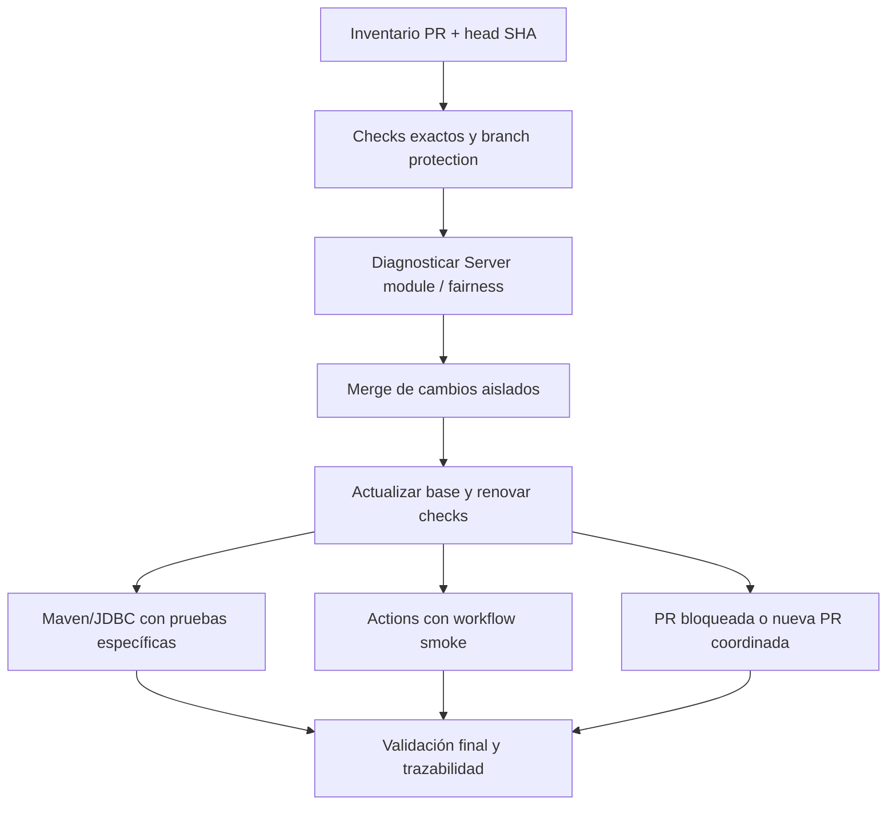

# Implementation Plan: Merge seguro de PRs de dependencias

## Task Source — User request: revisar y mergear con seguridad las PRs abiertas de Dependabot de ReplicaDB

### Acceptance Criteria

> ⚠️ Acceptance criteria inferred from the conversation because no JIRA ticket or explicit acceptance criteria were provided.
>
> **Inferred Acceptance Criteria:**
> - Las 15 PRs de dependencias abiertas quedan clasificadas como mergeable, bloqueadas, o pendientes de evidencia.
> - Cada merge se realiza solo contra el SHA exacto revisado, con todos los checks obligatorios completados y exitosos.
> - Las PRs que comparten `pom.xml`, `package.json`, `package-lock.json` o workflows se procesan secuencialmente y se actualizan después de cada merge.
> - No se mergea Vitest 5 en el frontend mientras el proyecto siga usando Vite 5.4.21.
> - El fallo común de `Server module` y el fallo de `Phase 3.4 fairness` quedan diagnosticados o explícitamente bloquean el avance.
> - Los upgrades mayores de JavaScript, Maven, JDBC o DuckDB tienen una validación específica de compatibilidad, no solo una compilación superficial.
> - Las actualizaciones de GitHub Actions se validan en los workflows que realmente consumen cada action, incluyendo el flujo de release y Pages.
> - El proceso conserva trazabilidad de los SHAs, resultados de CI, merges y decisiones de descarte o aplazamiento.
> - La automatización de Dependabot no puede interpretar checks ausentes, eventos incorrectos o un SHA obsoleto como aprobación.

## Overview

El repositorio tiene 15 PRs abiertas de Dependabot: cinco de frontend/docs, cinco de GitHub Actions y cinco de dependencias Maven. Los cambios son acotados a manifests, lockfiles o workflows, pero varias PRs comparten superficies y algunas introducen saltos mayores: Vitest 5, DuckDB 1.5.5.1, Azure Identity 1.18.6, JTOpen 21.0.7 y `download-artifact@v8`.

El objetivo es reducir el backlog sin convertir un check verde de una PR antigua en evidencia de seguridad para una rama ya cambiada. El flujo recomendado es secuencial: inventariar y congelar evidencia, resolver los gates comunes, mergear primero los cambios de bajo riesgo, validar cada superficie después del merge y dejar bloqueadas las PRs que necesiten una migración coordinada.

## Decisions

### D1: Estrategia de merge → Secuencial conservadora

**Why**: `#314`, `#315`, `#325` y `#326` comparten manifests o lockfiles de frontend/docs; las PRs Maven comparten `pom.xml`; y varias PRs de Actions ejecutan el mismo workflow. Un merge por vez permite atribuir cualquier regresión al cambio correcto y renovar los checks sobre la base actual.

**Assumptions / Constraints**: El merge se hará desde GitHub o `gh` con permisos adecuados. El plan no modifica código de producto para hacer pasar una PR de Dependabot. Cada PR debe volver a comprobarse si cambia su base o head SHA.

**Discarded**: Mergear por lotes — reduce tiempo operativo, pero aumenta conflictos y hace difícil distinguir una regresión de una actualización transitiva.

### D2: Criterio de seguridad → checks obligatorios verdes para el SHA exacto

**Why**: El aprendizaje de CI del proyecto establece que un evento de validación válido debe ser completado, exitoso, asociado a una PR abierta y coincidir con el head SHA exacto. Checks ausentes o de una revisión anterior deben esperar.

**Assumptions / Constraints**: `CodeQL`, GitGuardian, los workflows aplicables y los gates requeridos por branch protection son evidencia independiente. Un check omitido por paths debe entenderse según el workflow, no contarse automáticamente como éxito. El workflow de auto-merge debe comprobar todos los checks requeridos de la rama, no solo el workflow que lo dispara.

**Discarded**: Usar solo `mergeable_state=clean` o el compatibility score de Dependabot — ninguno demuestra que la revisión exacta haya pasado las pruebas funcionales del repositorio.

### D3: Upgrades mayores → validación específica o aplazamiento

**Why**: El repositorio compila con Java 17, usa Vite 5.4.21 en el frontend, y tiene integraciones JDBC reales. Los upgrades mayores pueden cambiar APIs, bytecode, comportamiento de tests o dependencias acopladas.

**Assumptions / Constraints**: Vitest 5 permanece bloqueado en el frontend mientras no se actualice Vite de forma coordinada. Azure Identity, JTOpen y DuckDB requieren pruebas de su integración efectiva, aunque el diff sea de una línea.

**Discarded**: Tratar toda PR de Dependabot como patch seguro por ser automática — contradice los precedentes del proyecto sobre API efectiva, bytecode y familias de dependencias.

## Architecture & Design — Approach: pipeline de merge secuencial con gates por superficie

Las PRs se tratan como operaciones remotas y auditables. El repositorio local puede usarse para comparar manifests y ejecutar validaciones, pero no se deben introducir cambios de código no solicitados para desbloquear una PR. El orden propuesto es:

1. `#314` React Router.
2. `#312` Playwright en docs.
3. `#325` Vitest en docs.
4. `#318` Jackson.
5. `#319` Surefire.
6. `#306` DuckDB, tras validación de integración.
7. `#316` JTOpen, tras validación DB2/i.
8. `#317` Azure Identity, tras validación de autenticación Azure.
9. `#320`, `#322`, `#323`, `#324` y `#321` de Actions, individualmente y con su workflow específico validado.
10. `#326` js-yaml/Redocly solo después de repetir y explicar `Phase 3.4 fairness`.

`#315` no entra en el flujo de merge: Vitest 5 declara Node 22 y Vite 6.4 como requisitos, mientras el frontend usa Vite 5.4.21. Requiere una decisión separada de actualización coordinada o un nuevo downgrade/refresh de Dependabot.

## PR Status

La tabla se completa en la tarea 1.1 y se actualiza después de cada merge o rebase. `pending`, `skipped` y `absent` no son equivalentes a `success`.

| PR | Head SHA | Change | Decision | Required checks | Risk / evidence |
|---|---|---|---|---|---|
| #306 | `b09eb1913fae92865202fde3fc804d90a9c9f733` | DuckDB 1.1.3 -> 1.5.5.1 | merged | 23 checks passed; 1 skipped | Auto/squash merge `91db9c08bf1201b5ab258941c98553d216fe9d2e`; full JDBC/integration, frontend, fairness, multinode, package, security, and CodeQL validation passed |
| #312 | `0d99b6e8b49ce447d0bbc2882288c19c3ba81c5e` | Playwright docs | merged | build, docs, shell-tests, GitGuardian, CodeQL success; drift/deploy skipped by conditions | Squash merge `b84ff5bb1d97aff8331b12150f11593c74f5d35d` |
| #314 | `040798e39d2bca76f4d0f8e6318ad28061c6396a` | React Router 6.30.6 | merged | Rebased CI: all applicable checks success; 3 skipped by workflow conditions | Squash merge `bb24c5424bf16684d19f6db8cdec54047532ff17`; DB2 rerun and Package release passed |
| #315 | `69437d631cec85f9bd301dc7a460e5513fbaab81` | Vitest 5 frontend | deferred | Documentation portal, frontend/CI, CodeQL, GitGuardian | Deferred to a future coordinated Vite 6.4+/Vitest migration; do not merge this PR independently |
| #316 | `1614a81ef52833a5c7186f5edb0ef714f1b8c025` | JTOpen 21.0.7 | merged | Full CI successful; CodeQL/GitGuardian successful; no IBM i live system in CI | Squash/auto merge `062c9fab57f2e6c47bcfb98d0e9aabdadf0cf0a7`; residual evidence limited to available DB2/CI coverage |
| #317 | `668254439b0d6f2b3d5d6b791a76719bd011b969` | Azure Identity 1.18.6 | merged | Full CI successful; SQL Server, package, frontend, fairness, multinode, security, and CodeQL passed | Auto/squash merge `92cf572dd855c923d054f13c98990ae317d6732b`; no real credentials used |
| #318 | `1600f9183fc5b6c1f6f424cd1945d953b9027840` | Jackson 2.22.2 | merged | 23 checks passed; 1 skipped | Auto/squash merge `a306238bddd0471c1d246bd56404d6f286115400` after full Maven, integration, package, security, and CodeQL validation |
| #319 | `880a0019d36eb0becaa2d941b6b0ee917d1bad19` | Surefire 3.6.0 | merged | 23 checks passed; 1 skipped | Auto/squash merge `a8ff2fabd1f0c14af8446fa7eb156684f80b2be1` after full Maven, integration, frontend E2E, fairness, multinode, security, and CodeQL validation |
| #320 | `48386bf70aae83f5c78cfe2f34a4aec54dbb8011` | upload-pages-artifact 5 | superseded | Validated through integration PR #328 | Closed after `#328` merge `33c6331a` |
| #321 | `f75cd35802ed683e788e63f79f348fe3d4f12fa4` | download-artifact 8 | superseded | Validated through integration PR #328 | Closed after `#328` merge `33c6331a` |
| #322 | `99f99b516c2d39e4c9786602431f1649db70a48d` | deploy-pages 5 | merged | Already present in current master | Merged before integration branch |
| #323 | `8127a05a7a7c81957ba7e024b6b68a687a1d3ff6` | configure-pages 6 | merged | 23 checks passed after Dependabot rebase | Auto/squash merge `ca025c6d63f1e820a329ad6a59f30a3181874f5e` |
| #324 | `34747e05cf337c81b89d4dc04726b4c2f761b86a` | setup-node 7 | merged | 27 checks passed after Dependabot rebase; docs/Pages and security gates green | Auto/squash merge `71da02533a0564d6941c65f79e2a2bbe75c09a31` |
| #325 | `a63b51899fc9508d93ae644ef64cd1396415e056` | Vitest 5 docs | merged | docs, Pages build, shell-tests, GitGuardian, CodeQL success; drift/deploy skipped by conditions | Squash merge `1f9b8ea53d9bb647eacfbda03a0eed54005b6b6c`; docs workspace build passed |
| #326 | `254b379ba436769c0299fb30e02046dafe678abe` | js-yaml/Redocly | superseded | Validated through integration PR #328; docs contract corrected and full CI green | Closed after `#328` merge `33c6331a` |
| #328 | `dcd86f29feba2307ff7aad91dbcfb8e383c072de` | Consolidated #320/#321/#326 plus Pages contract | merged | Full CI green: docs, frontend drift, Maven/integrations, fairness, multinode, package release, CodeQL, security | Squash merge `33c6331a29eaf9da7ccb8d2d68624af4f4166d73` |

## Implementation Tasks

### 1. Congelar inventario y estado de las PRs

- [x] **1.1 Registrar PRs, SHAs, archivos, estado de merge y checks actuales**
  Files: `implementation_plan.md`; GitHub PRs `#306`, `#312`, `#314`, `#315`, `#316`, `#317`, `#318`, `#319`, `#320`, `#321`, `#322`, `#323`, `#324`, `#325`, `#326`; `.github/dependabot.yml`; `.github/workflows/dependabot-auto-merge.yml`; `.github/workflows/rebase-dependabot-prs.yml`
  Changes: Usar `gh pr list --state open --author dependabot[bot] --json number,headRefOid,baseRefOid,title,state` y `gh pr view <number> --json files,commits,statusCheckRollup,mergeStateStatus` para capturar cada PR. Registrar el resultado en una tabla `## PR Status` de este `implementation_plan.md` con PR, SHA, versiones, checks, decisión y riesgo residual. Pausar el rebase automático mientras se procesa la tabla y reanudarlo solo entre PRs, nunca durante una validación en curso.
  Tests: Ejecutar una comprobación reproducible con `gh pr list`/`gh pr view` que falle si falta una de las 15 PRs, si el head SHA registrado no coincide con GitHub o si la PR cambió desde la última captura; verificar que el inventario no contiene credenciales, cookies ni tokens y que no hay dos rebases Dependabot concurrentes.
  Dependencies: None

### 2. Diagnosticar los gates que bloquean el backlog

- [x] **2.1 Aislar el fallo común de `Server module`**
  Files: `.github/workflows/CT_Push.yml`; `.github/workflows/docs.yml`; `.github/workflows/docs-pages.yml`; `replicadb-server/pom.xml`; `replicadb-server/src/test/**`; check runs de las 15 PRs
  Changes: Inspeccionar el job exacto `Server module` de `Only CI/CT` con `gh run view <run-id> --log-failed`, y consultar la ejecución equivalente de `master` mediante `gh run list --workflow CT_Push.yml --commit <sha>`. Clasificar el primer error como infraestructura, fallo preexistente o regresión de la PR, incluyendo `#314`, `#315` y `#326` aunque su workflow de documentación tenga una superficie distinta. No cambiar el workflow ni el código durante esta tarea salvo que una futura PR específica lo requiera.
  Tests: Repetir o consultar el job sobre el SHA exacto de cada PR afectada y sobre la base `master`; comparar resultado, job y primer error. El gate solo se considera resuelto cuando cada check requerido para la PR vigente termina `success`; un check ausente por `paths` queda como evidencia pendiente, no como éxito.
  Dependencies: 1.1

- [x] **2.2 Aislar el fallo de `Phase 3.4 fairness` de `#326`**
  Files: `scripts/phase3-fairness-test.sh`; `scripts/phase4-compose-common.sh`; `.github/workflows/CT_Push.yml`; check run de `#326`
  Changes: Determinar si el fallo es flaky, preexistente o introducido por el lockfile de frontend. Registrar el escenario, exit code y evidencia mínima necesaria; no aprobar `#326` por el hecho de que CodeQL y la mayoría de integraciones pasen.
  Tests: Ejecutar `bash scripts/phase3-fairness-test.sh` con la configuración CI y consultar su job de `Only CI/CT` mediante `gh run view <run-id> --log-failed`; comparar al menos una ejecución equivalente de `master`. Requiere dos ejecuciones verdes si se identifica flakiness antes de considerar el gate estable.
  Dependencies: 1.1

### 3. Mergear las PRs de bajo riesgo y refrescar la base

- [x] **3.1 Mergear `#314` React Router 6.30.4 → 6.30.6**
  Files: `replicadb-server/frontend/package.json`; `replicadb-server/frontend/package-lock.json`; PR `#314`
  Changes: Tras confirmar que el head SHA `040798e39d2bca76f4d0f8e6318ad28061c6396a` sigue vigente y que todos los gates aplicables, incluido el rerun de DB2, terminan verdes, mergear la PR con el método permitido por el repositorio. No aceptar cambios adicionales en el diff.
  Tests: Ejecutar `npm ci`, `npm run typecheck`, tests unitarios del frontend y el gate de frontend/documentación sobre el nuevo `master`; comprobar que las rutas existentes y la generación de tipos siguen funcionando. El primer fallo DB2 fue de infraestructura/workflow en `Get version`; el rerun debe completar `Integration tests` antes del merge.
  Dependencies: 2.1

- [x] **3.2 Mergear `#312` Playwright 1.49.1 → 1.63.0 en docs**
  Files: `docs/package.json`; `docs/package-lock.json`; PR `#312`
  Changes: Actualizar la PR si su base quedó obsoleta después de `#314`; mergear únicamente el cambio de Playwright y `@playwright/test` cuando Documentation portal, Documentation Pages, CodeQL y GitGuardian estén verdes.
  Tests: Ejecutar `npm run check`, `npm run build`, `npm run validate`, `npm test` y, cuando los browsers estén disponibles, `npm run test:e2e`; comprobar que los browsers requeridos por CI se instalan y que no se alteraron scripts de docs.
  Dependencies: 3.1

- [x] **3.3 Mergear `#325` Vitest 3.0.5 → 5.0.0 en docs**
  Files: `docs/package.json`; `docs/package-lock.json`; PR `#325`
  Changes: Rebasar o regenerar la PR sobre el `master` resultante de `#312` y mergearla solo si el build actual sigue verde. Confirmar Node 22 y la versión efectiva de Vite transitiva de Astro; no tratar el `npm test` del workspace raíz de `docs` como prueba de Vitest porque ejecuta tests Node.
  Tests: Ejecutar en `docs` `npm ci`, `npm run check`, `npm run build`, `npm run validate`, `npm test` y `npm run test:e2e`; ejecutar además `npm --prefix docs/markdown ci`, `npm --prefix docs/markdown run test` y `npm --prefix docs/markdown run test:e2e` para cubrir el workspace Vite/Vitest real. Revisar especialmente títulos parametrizados, tests concurrentes y entry points eliminados por Vitest 5.
  Dependencies: 3.2

### 4. Mergear dependencias Maven con validación incremental

- [x] **4.1 Mergear `#318` Jackson Databind 2.22.1 → 2.22.2**
  Files: `pom.xml`; PR `#318`
  Changes: Actualizar la PR sobre el `master` actual y mergear la única modificación de `jackson-databind` cuando el CI obligatorio y CodeQL/GitGuardian sean verdes. Comprobar que no se mezclan cambios de otras versiones Jackson ni del server POM.
  Tests: Ejecutar `mvn -B -DskipTests compile`, la suite no integrada, el server module y al menos los tests de serialización/API que consuman Jackson; revisar `mvn dependency:tree` para detectar una familia Jackson incoherente.
  Dependencies: 3.3, 2.1

- [x] **4.2 Mergear `#319` Surefire 3.5.3 → 3.6.0**
  Files: `pom.xml`; PR `#319`
  Changes: Rebasar la PR sobre el `master` actualizado y aceptar solo las dos referencias de versión de Surefire. Confirmar que la configuración `argLine` y los perfiles de test permanecen intactos.
  Tests: Ejecutar las suites JUnit del root y `replicadb-server`, incluyendo tests parametrizados, reruns y clases nested; comparar conteo de tests, fallos y reportes XML con la base anterior.
  Dependencies: 4.1, 2.1

- [x] **4.3 Validar y decidir `#306` DuckDB 1.1.3 → 1.5.5.1**
  Files: `pom.xml`; `src/test/**`; `replicadb-server/src/test/**`; PR `#306`
  Changes: Rebasar la PR y mantenerla abierta hasta validar el cambio de driver JDBC de test. Si el API o el comportamiento de tipos cambia, documentar el bloqueo y no hacer bypass; si todo es compatible, mergear la única versión de DuckDB.
  Tests: Ejecutar tests DuckDB, suite no integrada y cualquier prueba de conversión/metadata que use DuckDB; confirmar Java 17, carga del driver, creación de tablas, NULLs, tipos numéricos y cierre de conexiones. Revisar las correcciones de seguridad incluidas en 1.5.5.1.
  Dependencies: 4.2, 2.1

- [x] **4.4 Validar y decidir `#316` JTOpen 21.0.6 → 21.0.7**
  Files: `pom.xml`; `src/main/java/**`; `src/test/**`; PR `#316`
  Changes: Rebasar la PR y mergear únicamente si la dependencia sigue siendo compatible con el uso `provided` y no cambia el contrato de IBM i/DB2. Registrar como riesgo residual los cambios de conversión, virtual threads, Kerberos y propiedades JDBC del release upstream.
  Tests: Ejecutar compilación Java 17 y las pruebas disponibles del adapter DB2/i; comprobar carga opcional del driver, metadata, lectura/escritura y rutas de error sin un servidor IBM i disponible. Si no existe integración real, dejarlo como evidencia pendiente, no como éxito equivalente.
  Dependencies: 4.3, 2.1

- [x] **4.5 Validar y decidir `#317` Azure Identity 1.15.3 → 1.18.6**
  Files: `pom.xml`; `src/main/java/**`; `src/test/**`; PR `#317`
  Changes: Rebasar la PR y validar el upgrade usado por autenticación SQL Server. No incluir credenciales reales; revisar dependencias transitivas y compatibilidad de Java 17 antes de mergear.
  Tests: Ejecutar `mvn dependency:tree`, compilación limpia y pruebas SQL Server/mock del proveedor de credenciales; comprobar que la construcción del token, timeouts y manejo de errores mantienen el contrato. Una prueba contra Azure real solo puede usar identidad/secretos gestionados y logs redactados.
  Dependencies: 4.4, 2.1

### 5. Procesar las actualizaciones de GitHub Actions individualmente

- [x] **5.1 Validar y mergear `#324` setup-node 6 → 7**
  Files: `.github/workflows/docs-pages.yml`; `.github/workflows/docs.yml`; PR `#324`
  Changes: Actualizar la PR sobre `master` y aceptar únicamente los tres usos de `actions/setup-node`. Confirmar Node 22, npm cache y `cache-dependency-path` en cada workflow. La actualización manual puede requerir OAuth con scope `workflow`; si ese permiso no está disponible, usar `@dependabot rebase` y esperar un nuevo head. Como `.github/workflows/**` no está incluido en los `paths` de Pages, documentar explícitamente cuándo el check Pages es ausente y usar una validación manual o `workflow_dispatch` contra el ref exacto.
  Tests: Ejecutar los workflows docs y Pages de la PR o su equivalente autorizado; comprobar `npm ci`, cache, documentación y frontend drift. Un check Pages ausente por path no cuenta como verde. El merge queda bloqueado si `Server module` sigue fallando sin causa separada y el branch protection lo exige.
  Dependencies: 4.5, 2.1

- [x] **5.2 Validar y mergear `#323` configure-pages 5 → 6**
  Files: `.github/workflows/docs-pages.yml`; PR `#323`
  Changes: Rebasar y mergear solo el cambio de `actions/configure-pages`. Confirmar que permisos `contents: read`, concurrencia, artifact path y job deploy permanecen iguales.
  Tests: Ejecutar Documentation Pages en pull request cuando el path filter lo permita y, para este cambio de workflow, mediante `workflow_dispatch` o una ejecución controlada contra el ref exacto; verificar que la configuración de Pages y el artifact de `docs/dist` siguen resolviéndose. Actualizar cualquier test de contrato de workflows existente si detecta las versiones de action.
  Dependencies: 5.1

- [x] **5.3 Validar y mergear `#322` deploy-pages 4 → 5**
  Files: `.github/workflows/docs-pages.yml`; PR `#322`
  Changes: Rebasar sobre los cambios anteriores y mergear solo `actions/deploy-pages@v5`. Confirmar que el job conserva `needs: build`, environment, URL de deployment y permisos `pages: write`/`id-token: write`.
  Tests: Ejecutar build de Pages y un deployment controlado o dry-run permitido mediante el workflow apropiado, no asumir que el check PR se dispara por el cambio de workflow; no usar credenciales de producción para validar una PR.
  Dependencies: 5.2

- [x] **5.4 Validar y mergear `#320` upload-pages-artifact 3 → 5**
  Files: `.github/workflows/docs-pages.yml`; PR `#320`
  Changes: Rebasar y aceptar el cambio aislado de upload-pages-artifact. Confirmar que `docs/dist` contiene todos los assets necesarios y que no se depende de dotfiles ocultos.
  Tests: Ejecutar build de docs, inspeccionar el artifact generado y verificar el contenido publicado mediante una ejecución explícita del workflow; revisar los tests de contrato de workflow existentes y actualizar sus expectativas si validan versiones de actions. Si la documentación necesita dotfiles, bloquear y adaptar el workflow antes de mergear.
  Dependencies: 5.3

- [x] **5.5 Validar y decidir `#321` download-artifact 4 → 8**
  Files: `.github/workflows/CI_Release.yml`; PR `#321`
  Changes: Rebasar la PR y revisar los tres consumers de `download-artifact`. Confirmar que GitHub-hosted runners cumplen el requisito de Node 24/runner; verificar que los artifacts descargados son zip o archivos directos según el nuevo comportamiento y que no se requiere `skip-decompress` ni `digest-mismatch` explícito.
  Tests: Ejecutar el flujo de release sin publicar imágenes ni releases reales; comprobar Windows launcher, smoke de PostgreSQL embebido en Ubuntu/macOS/Windows, checksums y extracción de `release-staging`. Bloquear si aparece un mismatch de digest, un runner incompatible o una diferencia de descompresión.
  Dependencies: 5.4, 2.1

### 6. Resolver las PRs bloqueadas o incompatibles

- [x] **6.1 Aplazar `#315` Vitest 5 en el frontend hasta una migración coordinada**
  Files: `replicadb-server/frontend/package.json`; `replicadb-server/frontend/package-lock.json`; `replicadb-server/frontend/vite.config.*`; PR `#315`
  Changes: Confirmar el conflicto declarado por Vitest 5 con Vite 5.4.21. No mergear ni cerrar la PR actual; dejarla aplazada y planificar una migración coordinada futura de Vite 6.4+, plugin React, configuración y Vitest 5 como trabajo independiente.
  Tests: Mantener el frontend actual en Vitest 2.1.9 y ejecutar sus typecheck/unit/E2E en la validación normal. El plan futuro debe añadir pruebas de compatibilidad Vite 6.4+/Vitest 5, snapshots, configuración y CI antes de reabrir esta actualización.
  Dependencies: 3.1, 2.1

- [x] **6.2 Integrar `#326` tras rebase, corrección del contrato de Pages y CI completo verde**
  Files: `replicadb-server/frontend/package-lock.json`; `scripts/phase3-fairness-test.sh`; PR `#326`
  Changes: Mantener la rebase actual de Dependabot (`254b379`) y conservar `js-yaml` 4.3.2 y `@redocly/openapi-core` 1.34.20. Resolver primero el contrato de Pages que quedó desalineado por el merge previo de #323: `docs/tests/pages-workflow.test.mjs` espera `configure-pages@v5`, pero `.github/workflows/docs-pages.yml` usa `@v6`. Esta corrección es un follow-up separado de la actualización de dependencias; no ocultar el fallo relajando el test.
  Tests: Reejecutar `npm run check`, `npm run build`, `npm run validate`, `npm test` en `docs`, además de frontend drift, API contract, CodeQL, GitGuardian, fairness y suites de integración. Confirmar que el test de Pages valida las versiones actuales de las actions y que los límites de merge de js-yaml no rompen generación OpenAPI.
  Dependencies: 3.1, 2.2, 5.5

### 7. Revalidar y cerrar el lote

- [x] **7.1 Ejecutar la validación final de todo el repositorio**
  Files: `.github/workflows/CT_Push.yml`; `.github/workflows/CI_Release.yml`; `.github/workflows/docs.yml`; `.github/workflows/docs-pages.yml`; `pom.xml`; `replicadb-server/frontend/package.json`; `docs/package.json`; `implementation_plan.md`
  Changes: Ejecutar los workflows obligatorios sobre el head integrado `dcd86f29` y el merge `33c6331a`, actualizar la tabla `## PR Status` con PR, SHA mergeado, fecha, checks y riesgo residual, y confirmar que no quedan PRs Dependabot abiertas apuntando a versiones ya mergeadas o a una base obsoleta. Si un merge produce una regresión en packaging, release o runtime, detener el lote, revertir el merge commit, renovar checks y validar la reversión antes de continuar.
  Tests: CI completo de #328: docs, frontend drift, Maven/integraciones, server, frontend E2E, fairness, multinodo, package release, CodeQL y GitGuardian; además de validación local de docs (68 tests), frontend (259 tests), server (462 tests) y `git diff --check`.
  Dependencies: 6.2, 5.5, 4.5

- [x] **7.2 Verificar los gates de auto-merge y la trazabilidad**
  Files: `.github/workflows/dependabot-auto-merge.yml`; `.github/workflows/rebase-dependabot-prs.yml`; `.github/workflows/CT_Push.yml`; `implementation_plan.md`
  Changes: Verificar la trazabilidad de cada merge automático contra su head SHA exacto y registrar la integración #328. Confirmar que las PRs originales #320, #321, #326 y la aplazada #315 están cerradas con comentarios de destino; no activar bypass para checks ausentes o fallidos. La consulta de branch protection devolvió que `master` no está protegido en este repositorio, por lo que la evidencia válida fue el CI completo del head exacto y la revisión del workflow de auto-merge.
  Tests: Confirmar 0 PRs Dependabot abiertas, todos los checks de #328 completados sin fallos, merge commit `33c6331a`, y rama integrada local limpia/alineada con su remoto. Verificar que #315 quedó cerrada como aplazada y no mezclada en la integración.
  Dependencies: 7.1

## Technical Reference

Types & Data Structures

No se añaden tipos de dominio ni migraciones. Las estructuras operativas son el inventario de PRs, los head/base SHAs, el mapa de checks, la clasificación de riesgo y la tabla de decisiones. El plan debe conservar solo metadatos públicos de PR y resultados de CI; nunca secretos, tokens, cookies, credenciales o URLs sensibles.

Dependencies

La validación usa GitHub/GitHub CLI, Maven, Java 17, Node/npm según los `engines` de cada workspace, Vitest, Playwright, Docker/Testcontainers y los workflows existentes. Las pruebas Azure, IBM i/DB2 y release deben usar infraestructura o credenciales gestionadas por el entorno. No se introduce una dependencia de runtime para ejecutar el plan.

Testing Strategy

La evidencia se divide por superficie: lockfiles y tests de frontend/docs; compilación, dependency tree e integraciones JDBC para Maven; workflows específicos para Actions; y branch-protection/auto-merge para seguridad operativa. Los checks verdes de una PR solo son válidos para su SHA exacto. Los skips se documentan según la condición del workflow y nunca sustituyen una prueba requerida.

## Plan Status

Plan ejecutado a partir de la revisión de PRs de Dependabot realizada el 2026-09-16/17. La integración final está en PR #328, merge commit `33c6331a29eaf9da7ccb8d2d68624af4f4166d73`; el plan anterior de publicación del frontend en Cloud Run fue archivado en `.ai/archive/public-cloud-run-frontend-2026-09-16.plan.md`. #315 queda aplazada para una migración Vite/Vitest posterior. Este plan se ejecutó sin bypass de CI y con la corrección explícita del contrato de Pages desalineado por #323.

## Execution Retrospective (auto-generated by /itx-code)

### Plan Accuracy

- Tasks completed as planned: 20/20 (100%)
- Tasks that required plan adjustment: 3/20 (15%)
- Test loop iterations: 4 total (first-pass: 3, second-pass: 1)

### Gaps Encountered

#### Gap 1: Stale Dependabot heads produced misleading Server module failures (Plan-to-Implementation)

- **Tasks**: 2.1, 3.1, 4.1
- **Plan assumed**: The common `Server module` failure needed a shared product or CI diagnosis before merges.
- **Reality**: Several old PR heads failed the frontend TypeScript build while current `master` passed; rebasing exposed the actual PR state. One DB2 job also failed transiently in `Get version` and passed on rerun.
- **Resolution**: Rebased PRs before evaluating them and reran failed infrastructure jobs; merged only exact heads with complete green CI.
- **Learning**: Never classify a Dependabot PR from stale-head checks; always rebase or record an exact-head rerun before attributing failures.

#### Gap 2: Pages contract tests lagged behind already merged action upgrades (Intent-to-Plan)

- **Task**: 6.2 / integration validation
- **Plan assumed**: The consolidated dependency changes could be tested without a contract update outside the Dependabot lockfile.
- **Reality**: `docs/tests/pages-workflow.test.mjs` still expected `configure-pages@v5`, `upload-pages-artifact@v3`, and `deploy-pages@v4` after the corresponding Actions PRs had already merged.
- **Resolution**: The integration branch updated the contract expectations to `@v6`, `@v5`, and `@v5`; docs validation then passed all 68 tests.
- **Learning**: Workflow-version upgrades require updating repository-owned contract tests in the same integration change.

#### Gap 3: Vitest 5 was not independently mergeable in the frontend (Intent-to-Plan)

- **Task**: 6.1
- **Plan assumed**: The incompatibility could be handled as a simple Dependabot decision.
- **Reality**: The frontend remains on Vite 5.4.21 while Vitest 5 requires Vite 6.4+.
- **Resolution**: Closed #315 as deferred and explicitly excluded it from #328; a future Vite/Vitest migration remains separate.
- **Learning**: Major frontend test-runner upgrades must be coordinated with the bundler and plugin family.

### Patterns Discovered

- **Exact-head dependency gating**: rebase, run all applicable checks, and merge only the exact validated head.
- **Contract-test coupling for Actions**: action version bumps must update workflow contract assertions together with the workflow change.
- **Integration PR for shared dependency surfaces**: when several Dependabot PRs touch related workflows/lockfiles, consolidate them in an isolated branch and validate the combined state.
