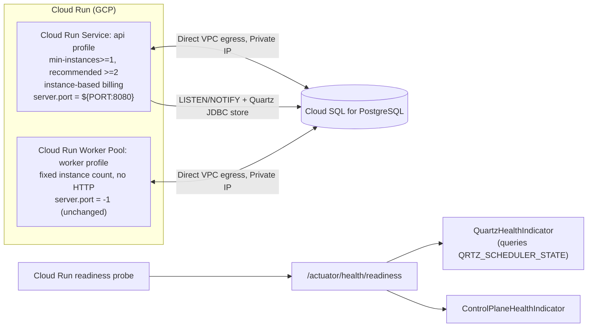

# Implementation Plan: GCP Cloud Run Deployment Readiness

## Task Source — User request: make ReplicaDB deployable on GCP Cloud Run (API + worker), grounded in an `/itx-explore` session covering Cloud Run Worker Pools GA, Quartz-clustered health, and Cloud SQL connectivity.

### Acceptance Criteria

> ⚠️ Acceptance criteria inferred from the `/itx-explore` conversation because no JIRA ticket exists for this change.
>
> **Inferred Acceptance Criteria:**
> - The API container honors the platform-injected `$PORT` environment variable without any other behavior change (default stays `8080` when `$PORT` is absent; the `worker` profile stays HTTP-free regardless of `$PORT`).
> - `QuartzHealthIndicator` reports `DOWN` when the current node's Quartz cluster checkin (`QRTZ_SCHEDULER_STATE`) is stale, not only when the in-process scheduler object has stopped.
> - The Quartz cluster health signal and the existing control-plane/queue signals are reachable through `/actuator/health/readiness` (not just the aggregate `/actuator/health`), on both `api` and `worker` profiles as applicable.
> - A scripted smoke check proves, in CI, that the packaged image (a) listens on an overridden `$PORT` for the `api` profile and (b) never opens a public HTTP port for the `worker` profile.
> - Operators have a dedicated, sidebar-registered documentation page describing how to run ReplicaDB's API as a Cloud Run Service (`min-instances≥1` functional floor, `≥2` recommended for production, instance-based billing) and the worker as a Cloud Run Worker Pool, connecting to Cloud SQL over Private IP + Direct VPC egress, consistent with the existing operations docs set.

## Overview

ReplicaDB's control plane already runs as two Spring profiles (`api`, `worker`) against external PostgreSQL, which maps cleanly onto Cloud Run except for three concrete gaps surfaced during exploration: the API ignores the platform's injected port, the Quartz cluster health check is blind to real cluster-checkin state, and there is no GCP-specific deployment guidance. This plan closes those three gaps and adds a validation script and documentation page, without introducing new dependencies or changing the existing JDBC-URL-based datasource model.

## Decisions

### D1: API deployment target on GCP → Cloud Run Service with `min-instances≥1` (recommended ≥2) and instance-based billing
**Why**: Preserves the existing clustered-JDBC Quartz model (`QuartzClusterConfiguration` already enforces `clustered-required=true` by default) with zero code changes to the scheduling architecture. Instance-based billing keeps CPU allocated outside request processing, which is what the API's Quartz thread pool (`threadCount: 2`) needs to keep checking in every `clusterCheckinInterval` (15s) even when idle.
**Assumptions / Constraints**: `min-instances=1` is functionally correct for Quartz clustered mode — clustering does not require a quorum or a minimum node count to operate, it only adds failover when more than one node exists. The floor of 1 is a control-plane availability trade-off, not a Quartz correctness requirement: with exactly one instance, any restart (deploy, crash, Cloud Run infra rebalancing) leaves the API/frontend/login briefly unreachable until the replacement instance boots, and any trigger due during that gap waits up to `misfireThreshold` (60s). `min-instances=2` removes that gap (one instance can be lost with zero perceived downtime) at the cost of a second continuously-billed instance. Treat this as an environment-specific operator choice: `1` is acceptable for dev/staging or cost-sensitive setups that tolerate brief restart windows; `≥2` is recommended for production. Cloud Run's own best practice recommends ≥3 min-instances for HA generally.
**Discarded**: Cloud Run Instances (singleton, Preview) — would require setting `clustered-required=false` and gives up HA entirely; request-based billing with `min=0` — directly reintroduces the CPU-throttling risk that motivated this plan.

### D2: Worker deployment target on GCP → Cloud Run Worker Pool
**Why**: Worker Pools reached GA in April 2026 and are purpose-built for "no public HTTP endpoint" pull-based workloads — exactly the worker's existing shape (`server.port: -1`, `LISTEN/NOTIFY` + polling + lease heartbeats, per [DEPLOYMENT.md](DEPLOYMENT.md#L1-L24)). The worker already operates with a fixed, operator-set instance count today (per `deployment.instructions.md`), which matches Worker Pools' manual-scaling model exactly — no new autoscaler is required to reach parity with the current Kubernetes/ECS topology.
**Assumptions / Constraints**: Worker Pools never scale to zero (`min=0` turns the pool off, not idle); this is an accepted cost trade-off, not a regression, since the worker never had scale-to-zero economics in any existing topology either.
**Discarded**: Running the worker as a Cloud Run Service — would require fabricating an HTTP listener the worker doesn't need, contradicting the "keep the worker profile HTTP-free" rule in [deployment.instructions.md](.github/instructions/deployment.instructions.md#L5).

### D3: Quartz cluster health verification → direct JDBC query against `QRTZ_SCHEDULER_STATE` per invocation
**Why**: The table already exists (`V15__create_quartz_jdbc_schema.sql`) and is already populated by Quartz itself every `clusterCheckinInterval`; querying it reuses the exact `DataSource`-injected `HealthIndicator` pattern already established by `ControlPlaneHealthIndicator`. No schema change, no new dependency, no background updater process to keep alive.
**Assumptions / Constraints**: Adds one lightweight indexed `SELECT` per health-check invocation; acceptable given Cloud Run/Kubernetes probe intervals are on the order of seconds, not per-request.
**Discarded**: An in-memory state updated by a background listener/scheduled task — avoids the per-call DB round trip but introduces a second failure mode (the updater silently stalling) and more code for a check that is itself only invoked a few times per minute.

### D4: Metadata PostgreSQL connectivity on GCP → Cloud SQL Private IP + Direct VPC egress
**Why**: Keeps `DB_URL` a plain `jdbc:postgresql://host:port/db` JDBC URL, matching how every part of ReplicaDB (CLI and server) already treats JDBC connections (see `JdbcDrivers.java` and the pervasive `jdbc:postgresql://...` pattern throughout the codebase). Requires no new Maven dependency.
**Assumptions / Constraints**: Requires provisioning a VPC/subnet (≥`/26`) and accepting the documented "up to a minute" cold-start connection delay on new revisions, mitigated with a startup probe (documentation only in this plan; no code change needed since Spring Boot's own retry/pool behavior already tolerates transient connection failures).
**Discarded**: Public IP + Cloud SQL Auth Proxy (Unix socket or Java socket factory) — changes the `DB_URL` shape and requires a new `com.google.cloud.sql:postgres-socket-factory` dependency, inconsistent with the plain-JDBC-URL assumption used everywhere else in the project.

### D5: Plan scope → code fixes + docs + a scripted portability smoke check (not IaC scaffolding)
**Why**: The project already validates deployment behavior with shell scripts (`scripts/phase3-*.sh`, `scripts/phase4-*.sh`) rather than maintained Terraform/IaC modules; adding a `scripts/phase5-gcp-portability-smoke.sh` in the same style closes the exact regression risk this plan is about (the `$PORT` fix or the worker's HTTP-free guarantee silently breaking) without introducing unvalidated infrastructure-as-code that nothing in CI can exercise.
**Assumptions / Constraints**: None beyond Docker being available in CI, which is already true for the existing phase3 image-smoke job.
**Discarded**: Adding Terraform/YAML Cloud Run manifests under a new `deploy/gcp/` directory — no CI can deploy or validate them, so they would be unvalidated surface area from day one, contradicting the project's existing script-based validation convention.

## Architecture & Design

Approach: minimal, additive changes to existing configuration/observability files plus documentation, validated by a new smoke script — no new runtime dependencies, no schema migration.

Integration points: `application.yml` (port placeholder), `application-api.yml` / `application-worker.yml` (readiness group composition, new `checkin-stale-factor` property), `QuartzHealthIndicator` (new `DataSource` dependency), `docs/astro.config.mjs` sidebar, `docs/tests/operations-contract.test.mjs` contract, `.github/workflows/CT_Push.yml` CI wiring.

Security/perf: the new Quartz health query never returns driver internals or connection strings (matches the existing `ControlPlaneHealthIndicator` catch-and-redact pattern); the readiness group change must keep `readinessState` in the `include` list so existing Kubernetes/ECS/Compose consumers of `/actuator/health/readiness` are not regressed.

## Implementation Tasks

### 1. Portability configuration
- [x] **1.1 Make the API's HTTP port honor the platform-injected `$PORT`**
  Files: `replicadb-server/src/main/resources/application.yml`; new `replicadb-server/src/test/java/org/replicadb/server/ServerPortPlaceholderTest.java`
  Changes: Change `server.port: 8080` to `server.port: ${PORT:8080}`. Do not touch `application-worker.yml` (`server.port: -1` stays a literal, unaffected by `$PORT`). Do not touch `bin/replicadb-server`'s `REPLICADB_SERVER_PORT` (display-only, unrelated).
  Tests: New test asserting: (a) with a `PORT` property present in the environment before context refresh, `environment.getProperty("server.port")` resolves to that value under the `api` profile; (b) with no `PORT` property, it resolves to `"8080"`; (c) under the `worker` profile, `server.port` resolves to `"-1"` even when a `PORT` property is present (regression guard, mirrors the existing assertion style in `DistributedWorkerLifecycleIT`).
  Dependencies: None

### 2. Observability — Quartz cluster health
- [x] **2.1 Make `QuartzHealthIndicator` cluster-checkin aware**
  Files: `replicadb-server/src/main/java/org/replicadb/server/observability/QuartzHealthIndicator.java`; `replicadb-server/src/main/resources/application-api.yml`; `replicadb-server/src/test/java/org/replicadb/server/observability/HealthIndicatorTest.java`
  Changes: Inject `DataSource` alongside the existing `Scheduler`. After confirming `scheduler.isStarted() && !scheduler.isShutdown()`, query `QRTZ_SCHEDULER_STATE` for `LAST_CHECKIN_TIME`/`CHECKIN_INTERVAL` filtered by `scheduler.getSchedulerName()` and `scheduler.getSchedulerInstanceId()`, using `Statement.setQueryTimeout(2)` (seconds) so a slow/contended pool never lets a single health probe block indefinitely. Add `@Value("${replicadb.server.scheduler.checkin-stale-factor:3}") int checkinStaleFactor` and mark the indicator `DOWN` with detail `scheduler=stale-checkin` when `now - LAST_CHECKIN_TIME > CHECKIN_INTERVAL * checkinStaleFactor`. Always add a `lastCheckinAgeMs` detail (whether UP or DOWN), and record its value on a Micrometer timer/gauge (e.g. `replicadb.managed.scheduler.checkin.age`, following the existing bounded-metric-family naming in `health-and-metrics.md`) so pool contention or checkin drift is observable before it ever flips readiness — this is the early-warning signal for correlated readiness failures under database latency spikes or Hikari pool saturation. If no row exists yet (start-up grace period, before Quartz's own checkin thread has written its first row), return `UP` with detail `scheduler=starting` rather than a false failure. Catch `SQLException`/`SchedulerException` (including the query-timeout case) and return `DOWN` with a redacted detail, following the existing catch-and-redact style in `ControlPlaneHealthIndicator`. Add `checkin-stale-factor: 3` explicitly under the existing `replicadb.server.scheduler` block in `application-api.yml`, next to `clustered-required: true`.
  Tests: In `HealthIndicatorTest.java`, add: `reportsQuartzUpWhenCheckinIsRecent` (mocked `Scheduler` + `DataSource`/`Connection`/`PreparedStatement`/`ResultSet` returning a recent `LAST_CHECKIN_TIME`, asserts `Status.UP` and a `lastCheckinAgeMs` detail is present); `reportsQuartzDownWhenCheckinIsStale` (same mocks with a stale `LAST_CHECKIN_TIME`, asserts `Status.DOWN` and detail `scheduler=stale-checkin`, and asserts the health output never contains SQL/driver text); `reportsQuartzUpDuringStartupGraceWhenNoCheckinRowYet` (`ResultSet.next()` returns `false`, asserts `Status.UP` with detail `scheduler=starting`); `reportsQuartzDownWhenSchedulerNotStarted` (existing behavior preserved regardless of DB state); `reportsQuartzDownWhenCheckinQueryTimesOut` (mocked statement throws a timeout `SQLException`, asserts `Status.DOWN` without leaking driver text).
  Dependencies: None

- [x] **2.2 Wire custom health indicators into the Actuator `readiness` group**
  Files: `replicadb-server/src/main/resources/application-api.yml`; `replicadb-server/src/main/resources/application-worker.yml`; `replicadb-server/src/test/resources/application-api.yml`; `replicadb-server/src/test/java/org/replicadb/server/HealthEndpointTest.java`; `replicadb-server/src/test/java/org/replicadb/server/WorkerManagementEndpointIT.java`
  Changes: In `application-api.yml`, add `management.endpoint.health.group.readiness.include: readinessState,controlPlane,quartz,runQueue` and `management.endpoint.health.group.readiness.show-components: always` (scoped to the `readiness` group only, so the existing `management.endpoint.health.show-details: when_authorized` behavior for `/actuator/health` and `/actuator/health/liveness` is unchanged). In `application-worker.yml`, add `management.endpoint.health.group.readiness.include: readinessState,controlPlane,workerRuntime` and `management.endpoint.health.group.readiness.show-components: always` (leaving the existing `show-details: never` untouched for the aggregate endpoint). Synchronize the test-only `src/test/resources/application-api.yml` with the production API readiness group and `checkin-stale-factor` so context tests do not silently omit the production health contract. Without the group-scoped `show-components: always`, the unauthenticated readiness response never breaks down into a `"components"` map, so this is required for both the acceptance criterion and the tests below to be checkable. During implementation, verify the exact component keys against a live `/actuator/health/readiness` response (Spring Boot derives bean IDs from the `HealthIndicator` bean name minus the `HealthIndicator` suffix) before finalizing the `include` lists, since derivation could differ from the assumed camelCase names.
  Tests: Extend `HealthEndpointTest.java` with `readinessGroupIncludesControlPlaneAndQuartzComponents`, asserting the unauthenticated `GET /actuator/health/readiness` body contains `"components"` entries for `quartz` and `controlPlane` (string-contains assertions, consistent with the existing test's style), while keeping the existing liveness/readiness "publicly probeable" assertions unchanged as a regression guard. Extend `WorkerManagementEndpointIT.java` with an equivalent assertion that the worker's readiness body contains `controlPlane` and `workerRuntime`.
  Dependencies: Task 2.1

### 3. Deployment validation
- [x] **3.1 Add a GCP portability smoke script**
  Files: new `scripts/phase5-gcp-portability-smoke.sh`; new `scripts/fixtures/gcp-smoke.override.yml`; `scripts/README.md`
  Changes: New script, styled after `scripts/phase3-image-smoke.sh` (image build via `docker build --build-arg SERVER_VERSION=... --build-arg SERVER_JAR=...`) and `scripts/phase3-compose-smoke.sh`. Reuse `docker-compose.server.yml` for PostgreSQL/keyring/bootstrap provisioning and add the new fixture override because the base Compose file hardcodes API port `8080` healthchecks/publication. The override must define an API smoke service using the same image/build context with `PORT=9500`, an API healthcheck against `9500`, and host mapping `127.0.0.1:9500:9500`; define a worker smoke service with the worker profile and its management port exposed only as needed for the test. Start it with `docker compose -f docker-compose.server.yml -f scripts/fixtures/gcp-smoke.override.yml up -d --build` without `--wait`, then use bounded HTTP retries (60 seconds maximum) so a broken `$PORT` fails at the explicit API assertion instead of waiting indefinitely for Compose's healthcheck. Assert `curl -fsS http://127.0.0.1:9500/actuator/health/liveness` succeeds while host port `8080` refuses connections, then use `docker compose exec worker-one curl -fsS http://127.0.0.1:9091/actuator/health/liveness` (the worker management server is loopback-bound in its container) and separately confirm no process in the worker container listens on `8080`. Register a cleanup trap matching `scripts/phase3-compose-smoke.sh`, redact diagnostics, and use the repo-root/script-dir resolution and `set -euo pipefail` patterns already established. Add a one-line entry to `scripts/README.md` describing the script's purpose.
  Tests: The script itself is the executable test; exit code `0` on success, non-zero with a clear message on any assertion failure. As a one-time manual implementation check (not a permanent CI step), temporarily revert Task 1.1's `application.yml` change, confirm the script fails on the `$PORT` assertion, then restore the fix and confirm the script passes.
  Dependencies: Task 1.1, Task 2.2

- [x] **3.2 Wire the smoke script into CI**
  Files: `.github/workflows/CT_Push.yml`
  Changes: Add a new step invoking `scripts/phase5-gcp-portability-smoke.sh`, placed alongside the existing `scripts/phase3-image-smoke.sh` step, using the same job/dependency structure already used for that step.
  Tests: A green CI run on the branch that includes this step is the acceptance signal; no additional local test beyond re-running the script locally as in 3.1.
  Dependencies: Task 3.1

### 4. Documentation
- [x] **4.1 Write the GCP Cloud Run operations page**
  Files: new `docs/src/content/docs/operations/gcp-cloud-run.mdx`
  Changes: New page following the frontmatter/prose/table conventions of `distributed-deployment.mdx`, covering: the API as a Cloud Run Service (`min-instances≥1` as the functional floor, `≥2` recommended for production redundancy, with the restart-gap trade-off explained per D1; instance-based billing; `${PORT}` behavior); the worker as a Cloud Run Worker Pool (manual/fixed instance count, no autoscaler, no HTTP, matching the existing `LISTEN/NOTIFY` + polling + lease model); Cloud SQL over Private IP + Direct VPC egress (`DB_URL` stays a plain JDBC URL; note the documented cold-start connection delay and the recommendation to configure a startup probe); what `/actuator/health/readiness` now reports, including why Cloud Run's own service-health mechanism requires `min-instances≥1` to be meaningful; and a rollout-safety note that brief readiness dips during rolling deploys (an old instance's checkin naturally aging past the stale threshold while it drains) are expected, not an incident.
  Tests: Run the docs test suite (`npm test` under `docs/`, covering `docs/tests/content-contract.test.mjs` and `docs/tests/operations-contract.test.mjs`) and the slug-uniqueness check (`docs/scripts/check-content-slugs.mjs`) to confirm the new page doesn't collide with an existing slug.
  Dependencies: Task 1.1, Task 2.1, Task 2.2

- [x] **4.2 Register the new page in navigation**
  Files: `docs/astro.config.mjs`; `docs/src/content/docs/operations/index.md`
  Changes: Add `'operations/gcp-cloud-run'` to the `Operations` sidebar array in `astro.config.mjs` (after `operations/distributed-deployment`), and add a matching bullet link in `operations/index.md`, consistent with the existing entries' phrasing style.
  Tests: `docs/scripts/check-content-slugs.mjs` (already covered by 4.1's test run) and a manual `astro build`/`astro check` (or the project's existing docs build script) confirming the sidebar renders without a broken-link warning.
  Dependencies: Task 4.1

- [x] **4.3 Cross-link the new page and update DEPLOYMENT.md**
  Files: `docs/src/content/docs/operations/distributed-deployment.mdx`; `docs/src/content/docs/operations/health-and-metrics.md`; `DEPLOYMENT.md`
  Changes: Add a short cross-reference note in `distributed-deployment.mdx` pointing to the new GCP page for platform-specific guidance. In `health-and-metrics.md`, mention the new `scheduler=stale-checkin` detail, the `lastCheckinAgeMs` detail/metric, that the readiness group now includes `quartz`/`controlPlane`(/`workerRuntime`), and that brief readiness dips correlated with deploy timestamps are expected during rolling deploys rather than incidents. In `DEPLOYMENT.md`, add a short pointer to the new docs page near the existing topology section.
  Tests: Re-run `docs/tests/operations-contract.test.mjs` and `docs/tests/content-contract.test.mjs` to confirm no broken assertions from the added cross-references.
  Dependencies: Task 4.1

- [x] **4.4 Extend the operations content contract test for the new page**
  Files: `docs/tests/operations-contract.test.mjs`
  Changes: The suite builds its combined `docs` string two different ways: a mapped array of bare names that each get `.md` appended, and separately-joined full paths for `.mdx` files (currently only `distributed-deployment.mdx`). Because the new page is a `.mdx` file, add `join(operationsRoot, 'gcp-cloud-run.mdx')` alongside the existing `distributed-deployment.mdx` entry in that second, separately-joined list — do NOT add the bare name `'gcp-cloud-run'` to the mapped `.md` array, since that would incorrectly resolve to `gcp-cloud-run.mdx.md`. Then add required tokens specific to the new page's key concepts (e.g. `'Worker Pool'`, `'Direct VPC egress'`, `'min-instances'`, `'Cloud SQL'`, `'instance-based billing'`) to the existing `required` token list, following the file's established assertion pattern.
  Tests: `node --test docs/tests/operations-contract.test.mjs` (or the project's existing docs test command) passes with the new file included.
  Dependencies: Task 4.1

## Technical Reference

Types & Data Structures

No new domain types. `QuartzHealthIndicator` gains a `DataSource` constructor dependency and an `int checkinStaleFactor` field, mirroring the existing `ControlPlaneHealthIndicator(DataSource)` shape. `QRTZ_SCHEDULER_STATE` columns used (already migrated in `V15__create_quartz_jdbc_schema.sql`): `SCHED_NAME`, `INSTANCE_NAME`, `LAST_CHECKIN_TIME` (epoch millis), `CHECKIN_INTERVAL` (millis).

Dependencies

No new Maven or npm dependencies. No new database migration (the required table already exists). No new environment variables beyond the existing Spring-relaxed-binding behavior for `PORT` and the new `replicadb.server.scheduler.checkin-stale-factor` property (overridable via `REPLICADB_SERVER_SCHEDULER_CHECKIN_STALE_FACTOR` if an operator needs it, following existing relaxed-binding conventions).

Testing Strategy

Unit tests for the new placeholder-resolution behavior and the enhanced `QuartzHealthIndicator` (mocked `DataSource`/`Scheduler`, no real database). Integration tests (`HealthEndpointTest`, `WorkerManagementEndpointIT`) extended to assert the readiness group composition over real HTTP against a real Spring context (Testcontainers PostgreSQL, per existing `PostgresTestcontainersConfig`). A new shell-script-based smoke test (`scripts/phase5-gcp-portability-smoke.sh`) validates the packaged container image end-to-end, matching the project's existing `phase3-*.sh` conventions rather than introducing a new testing framework. Documentation changes are validated by the existing Node-based docs contract tests (`docs/tests/*.test.mjs`) plus the slug-uniqueness script.

## Execution Retrospective (auto-generated by /itx-code)

### Plan Accuracy
- Tasks completed as planned: 7/9 (77.8%)
- Tasks that required plan adjustment: 2/9 (22.2%)
- Test loop iterations: 12 total (7 first-pass, 3 second-pass, 2 third-pass)

### Gaps Encountered

#### Gap 1: API test profile drift was missed during planning (Intent-to-Plan)
- **Task**: 2.2 — Wire custom health indicators into the Actuator `readiness` group
- **Plan assumed**: The integration tests used the production API profile without a separate test resource override.
- **Reality**: `src/test/resources/application-api.yml` existed and omitted the new readiness group and Quartz threshold, so the first readiness assertion could not see the configured components.
- **Resolution**: Synchronized the test profile with production and added the test resource to the task files.
- **Learning**: Always search `src/test/resources` for profile-specific configuration before planning Spring context or endpoint changes.

#### Gap 2: Compose health waiting obscured the intended PORT failure (Plan-to-Implementation)
- **Task**: 3.1 — Add a GCP portability smoke script
- **Plan assumed**: `docker compose up --wait` would make a broken API port fail quickly at the explicit HTTP assertion.
- **Reality**: Compose waited on the overridden API healthcheck until its retry window expired, hiding the `$PORT` assertion and exceeding the execution limit.
- **Resolution**: Started Compose without `--wait` and added bounded 60-second HTTP retries; the intentional fixed-port regression then failed at the expected assertion and cleaned up correctly.
- **Learning**: Deployment smoke tests should own bounded readiness waits when they need to validate a specific port or endpoint failure mode.

### Patterns Discovered
- Profile configuration synchronization: production and test profile YAML must evolve together; see `replicadb-server/src/test/resources/application-api.yml`.
- Cloud Run portability smoke: derive artifact versions from the module POM and generate temporary secrets inside the workspace-owned state directory so Docker daemon mounts remain reproducible.
- Cluster health observability: a bounded database check plus a last-observed age gauge makes Quartz readiness failures diagnosable without exposing database errors.
