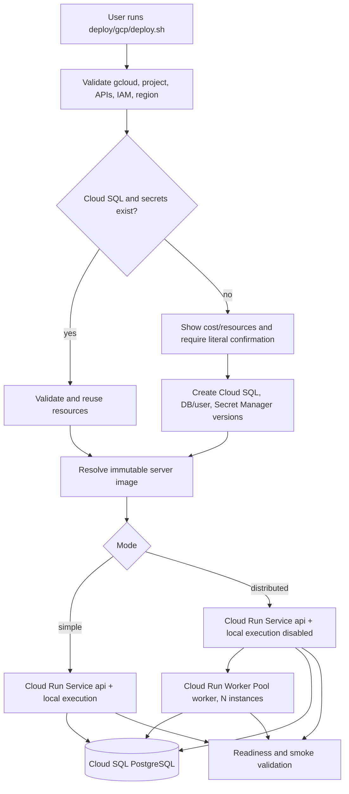

# Implementation Plan: Guided Cloud Run Deployment Bundle

## Task Source — User request: package ReplicaDB so users can deploy it simply to Cloud Run, with `simple` and `distributed` modes, optional Cloud SQL and Secret Manager creation, and a path that remains compatible with a future Google Cloud Marketplace strategy.

### Acceptance Criteria

> ⚠️ Acceptance criteria inferred from the `/itx-explore` conversation because no JIRA ticket exists for this change.
>
> **Inferred Acceptance Criteria:**
> - A user can run one documented guided command from a clean checkout or release bundle to deploy ReplicaDB to Cloud Run in either `simple` or `distributed` mode.
> - The deployer uses an immutable ReplicaDB server image reference, defaulting to the existing release image `osalvador/replicadb-server:<version>` and supporting an explicit digest override; it never silently uses `latest` for production mode.
> - `simple` deploys one Cloud Run API Service with local execution enabled and external PostgreSQL; `distributed` deploys the API with local execution disabled plus a Cloud Run Worker Pool with a configurable instance count.
> - The deployer can reuse existing Cloud SQL/Secret Manager resources or, only after explicit confirmation, create the required Cloud SQL PostgreSQL instance, database/user, and secrets.
> - Credentials, key material, and passwords are never printed, committed, placed in image arguments, or exposed in command diagnostics; Secret Manager references are pinned to explicit versions where Cloud Run supports it.
> - The deployer configures the API port contract, instance-based billing, minimum instances, authenticated ingress, health/readiness checks, service identity, and VPC connectivity according to the selected mode.
> - The deployer validates the resulting deployment with API readiness, worker status/log checks, database connectivity evidence, and a small optional smoke operation without exposing the worker as a public HTTP service.
> - A documented cleanup command can remove only resources created by the deployment, with a confirmation barrier for destructive operations.
> - Documentation clearly distinguishes this self-managed Cloud Run bundle from a Google Cloud Marketplace Container Image Product, GKE Marketplace App, and Marketplace SaaS offering.

## Overview

ReplicaDB already publishes a managed server image from the release workflow and already contains the runtime contracts needed by Cloud Run: `api` reads the platform `PORT`, `worker` has no product HTTP port, and both profiles use external PostgreSQL and a shared keyring. The missing product surface is an operator-friendly deployment bundle that composes those existing pieces without expanding the Spring-free CLI. This plan adds a guided `gcloud` script under `deploy/gcp`, supports two topology modes, protects resource creation and secret handling, and verifies the deployment end to end.

## Decisions

### D1: Deployment interface → guided shell bundle under `deploy/gcp`, not a Java CLI subcommand
**Why**: The root CLI is intentionally Spring-free and preserves a portable replication artifact. Cloud Run deployment depends on external `gcloud`, IAM, Cloud SQL, Secret Manager, and platform-specific flags; keeping it in an operations bundle avoids coupling the replication CLI to a cloud SDK while matching the repository's existing shell-script deployment conventions.
**Assumptions / Constraints**: The supported local environment has Bash, `gcloud`, `curl`, `jq`, and standard POSIX tools. The script must fail with actionable prerequisites rather than attempting to install cloud tooling.
**Discarded**: `replicadb deploy gcp` inside `src/main/java` — expands the core CLI contract, multiplatform behavior, and release artifact for a deployment concern that can remain external.

### D2: User topologies → two explicit modes, `simple` and `distributed`
**Why**: A single mode cannot serve both the lowest-friction trial and the production topology. `simple` keeps execution in the API and only requires one Cloud Run Service plus PostgreSQL; `distributed` preserves the existing API/worker separation and uses a Worker Pool with manual scaling.
**Assumptions / Constraints**: `simple` is a convenience topology, not a replacement for the HA/distributed architecture. `distributed` requires a worker instance count of at least one and has no automatic queue-depth autoscaling.
**Discarded**: Always deploying distributed mode — technically coherent but unnecessarily expensive and complex for first-time users.

### D3: Image source → existing versioned Docker Hub image, with digest validation and optional mirror
**Why**: The release workflow already publishes `osalvador/replicadb-server:<version>`, and Cloud Run officially supports public Docker Hub images, so the first installer can work without requiring every user to create an Artifact Registry repository or build locally. The script resolves or accepts a digest for reproducibility and can mirror the image to Artifact Registry when the user's policy or availability requirements demand it.
**Assumptions / Constraints**: Public registry access, image architecture, and organization policy may differ by project. Preflight must validate the selected image before any durable resource creation and report a clear mirror option when Docker Hub is blocked.
**Discarded**: Always building/pushing into the user's Artifact Registry — more setup and permissions before the first deployment; retained as an explicit production option rather than a hard prerequisite.

### D4: PostgreSQL and secret ownership → hybrid, explicit reuse or confirmed creation
**Why**: Existing customer infrastructure should be reusable, while a first-time developer needs a path that can create Cloud SQL and Secret Manager resources. Creation is never inferred from missing credentials alone: the script displays the target project, region, Cloud SQL tier, HA/backups, and resources before requiring literal confirmation.
**Assumptions / Constraints**: Cloud SQL is durable and billable; database password and keyring are generated locally only long enough to write Secret Manager values and are never printed. Non-interactive mode fails unless all resource identifiers and secret versions are supplied.
**Discarded**: Always create infrastructure — unsafe for existing projects and production cost control; always require infrastructure — too much friction for a guided dev install.

### D5: Secret delivery → Secret Manager environment references, not mounted keyring files
**Why**: ReplicaDB supports inline keyring variables and Cloud Run resolves Secret Manager environment references at instance startup. This avoids filesystem ownership differences, especially Worker Pool secret volumes running in the second-generation environment, and keeps secrets out of the image and shell diagnostics.
**Assumptions / Constraints**: The runtime service accounts need Secret Manager Secret Accessor; versions are pinned. The deployer may use temporary local files for generated input but must clean them with a trap.
**Discarded**: Mounting the keyring file as the default — more sensitive to path/ownership semantics and harder to make consistent between Service and Worker Pool.

### D6: Cloud networking → reuse an existing VPC/subnet by parameter, no implicit network mutation
**Why**: The environment investigation found Amanda-style projects already have managed VPC/subnets and Service Networking peering. The bundle must accept `--network`/`--subnet` and validate them, but must not create or alter shared network resources implicitly.
**Assumptions / Constraints**: Direct VPC egress and Cloud SQL private IP require the user/project administrator to provide a compatible network and subnet; the script reports missing IAM or API prerequisites.
**Discarded**: Automatically create a VPC/subnet — high blast radius in customer projects and outside the deployment bundle's minimum responsibility.

### D7: Marketplace scope → document compatibility boundaries, do not package Marketplace integration now
**Why**: Google Marketplace distinguishes Container Image Products, GKE Marketplace Apps, and integrated SaaS. A Cloud Run image plus deploy script is not itself an automatic Marketplace installer. This plan keeps the self-managed Cloud Run bundle independent while preserving immutable images and documented deployment metadata that can later feed a Marketplace or GKE package.
**Assumptions / Constraints**: Marketplace onboarding requires partner/vendor processes, reviews, production readiness, support, and product-specific packaging; no Marketplace account or listing exists in this task.
**Discarded**: Pretending a Container Image Product deploys the full stack — technically false and misleading for users.

### D8: Release distribution → include the deployment bundle in the server package
**Why**: The acceptance criterion promises a clean release bundle experience, while the existing `scripts/package-server-release.sh` only packages the launcher, JAR, configuration example, README, and license. Including `deploy/gcp` makes the guided installer available without a repository checkout.
**Assumptions / Constraints**: The bundle must resolve its package root rather than assuming the Git checkout layout; release CI must package and test it before publication.
**Discarded**: Documenting the script only in the repository — fails the promised release-bundle experience.

## Architecture & Design

Approach: guided `gcloud` bundle with explicit resource discovery, optional resource creation, and mode-specific deployment.

The bundle is an orchestration adapter, not a new ReplicaDB runtime. It owns naming, input validation, gcloud calls, secret references, idempotent discovery, cleanup labels, and verification. ReplicaDB continues to own database migrations, Quartz schema, authentication, keyring resolution, leases, polling, and run execution.

The deployer should produce a redacted state file containing resource names, region, mode, image digest, secret names/versions, and deployment timestamp, but never secret payloads. Cleanup uses that state plus a deployment label/prefix and requires confirmation before deleting Cloud SQL, secrets, or Cloud Run resources.

## Implementation Tasks

### 1. Deployment contract and input model
- [x] **1.1 Define the guided deployment interface and safe defaults**
  Files: new `deploy/gcp/deploy.sh`; new `deploy/gcp/config.example.env`; new `deploy/gcp/README.md`; new `deploy/gcp/tests/test_runner.sh`; new `deploy/gcp/tests/stubs/`
  Changes: Define commands `deploy.sh preflight`, `deploy.sh deploy --mode simple|distributed`, `deploy.sh verify`, and `deploy.sh destroy`; support environment variables and flags for project, region (default `europe-west4` only as an example, never hard-code an Amanda project), image/tag/digest, Cloud SQL identifiers, secret names, VPC network/subnet, service accounts, API min instances, worker instance count, and `--create-cloud-sql`. Make `deploy` refuse ambiguous input, print a redacted summary, require the exact confirmation token `CREATE CLOUD SQL` before creating durable database infrastructure, and default to no public unauthenticated access. Keep the script independent of repository-local absolute paths so it can be copied into a release bundle. Establish the shared stub-command test harness and isolated temporary HOME/PATH here so later task tests are runnable in dependency order.
  Tests: Shell unit tests for help/unknown command, missing `gcloud`, missing project, invalid mode, invalid image reference, invalid instance counts, non-interactive missing values, redacted summary output, and confirmation refusal/acceptance using the shared stub binaries; assert no real gcloud command is invoked.
  Dependencies: None

- [x] **1.2 Add a redacted deployment state and naming contract**
  Files: new `deploy/gcp/lib/state.sh`; new `deploy/gcp/lib/naming.sh`; new `deploy/gcp/tests/state_test.sh`; new `deploy/gcp/tests/naming_test.sh`
  Changes: Define deterministic names with a configurable prefix, length-safe Cloud Run/Worker Pool names, a resource label such as `replicadb-deployment=<deployment-id>`, atomic state writes, state schema version, and cleanup ownership markers. Store only resource IDs, image digest, secret names/versions, mode, project, region, and timestamps. Reject state files containing known secret keys or password-like values.
  Tests: Round-trip state save/load; atomic replacement after interruption simulation; rejection of secret-shaped fields; stable naming for simple/distributed deployments; names under Cloud Run's length limits; collision behavior for two deployment IDs.
  Dependencies: Task 1.1

### 2. Preflight and image distribution
- [x] **2.1 Validate gcloud, project, APIs, IAM, and region without mutations**
  Files: `deploy/gcp/deploy.sh`; new `deploy/gcp/lib/preflight.sh`; new `deploy/gcp/tests/preflight_test.sh`
  Changes: Implement read-only checks for active gcloud authentication, target project existence, billing/API visibility, Cloud Run/Artifact Registry/Cloud SQL/Secret Manager/Compute/Service Networking APIs, regional availability, required roles or actionable permission errors, and network/subnet existence. Support `CLOUDSDK_PYTHON`/`CLOUDSDK_PYTHON_SITEPACKAGES` guidance for beta Worker Pool commands without installing components or prompting for sudo. Make preflight show whether Worker Pool commands are available and fail clearly if the selected distributed mode cannot be supported. Validate the selected image source before any durable resource creation using registry inspection and a Cloud Run dry-run/admissibility check; report an explicit Artifact Registry mirror path when organization policy blocks Docker Hub.
  Tests: Stub gcloud responses for all APIs present, API missing, expired auth, wrong project, missing Cloud Run Developer/Service Account User/Secret Manager/Cloud SQL permissions, unavailable region, missing subnet, missing beta Worker Pool command, public Docker Hub image accepted, blocked registry policy, and invalid image architecture; assert no mutating gcloud command is called.
  Dependencies: Task 1.1

- [x] **2.2 Resolve and optionally mirror an immutable server image**
  Files: `deploy/gcp/lib/image.sh`; `deploy/gcp/tests/image_test.sh`; `deploy/gcp/README.md`
  Changes: Accept an explicit digest, version tag, or configured image URI. Resolve a tag to a digest with registry tooling where available, reject `latest` for distributed/production confirmation unless explicitly overridden, optionally mirror the release image into a user-provided Artifact Registry repository, and persist only the final image URI/digest in state. Never pass secrets through Docker build args or print registry credentials. If a registry cannot be inspected directly, require an explicit digest instead of silently deploying a mutable tag.
  Tests: Stub Docker/gcloud image inspection for tag-to-digest resolution, digest input, missing image, latest rejection, mirror success/failure, and redacted output; verify the generated Cloud Run commands use the digest.
  Dependencies: Task 1.2, Task 2.1

### 3. Cloud SQL and Secret Manager lifecycle
- [x] **3.1 Discover and validate an existing Cloud SQL PostgreSQL instance**
  Files: `deploy/gcp/lib/cloud_sql.sh`; `deploy/gcp/tests/cloud_sql_test.sh`; `deploy/gcp/README.md`
  Changes: Given an instance name or connection name, validate region, PostgreSQL version, state, private IP availability, database existence, user availability, network connectivity prerequisites, and connection budget. Accept an existing `DB_URL`/credential secret set without echoing values. Produce explicit diagnostics when the user has a public-IP-only instance but requested Private IP + Direct VPC egress.
  Tests: Stub `gcloud sql instances describe`, database/user listing, and secret lookups for valid, stopped, wrong-region, missing-private-IP, missing-database, missing-user, and permission-denied scenarios.
  Dependencies: Task 2.1

- [x] **3.2 Create Cloud SQL and database prerequisites only after confirmation**
  Files: `deploy/gcp/lib/cloud_sql.sh`; `deploy/gcp/lib/rollback.sh`; `deploy/gcp/tests/cloud_sql_create_test.sh`; `deploy/gcp/README.md`
  Changes: Implement explicit creation of a PostgreSQL Cloud SQL instance with configurable tier, storage, HA, backups, deletion protection, region, private network, database, and application user. Show a redacted cost/resource summary and require literal `CREATE CLOUD SQL` confirmation. Track each created resource in state and register rollback/cleanup handlers; never print generated passwords.
  Tests: Stub successful creation and each failure boundary; assert ordering (network prerequisites before instance, instance before database/user), rollback of only resources created by this run, refusal without exact confirmation, and no secret values in logs/state.
  Dependencies: Task 1.2, Task 2.1, Task 3.1

- [x] **3.3 Create and validate version-pinned Secret Manager values**
  Files: `deploy/gcp/lib/secrets.sh`; `deploy/gcp/tests/secrets_test.sh`; `deploy/gcp/README.md`
  Changes: Support reuse of existing secret names/versions and creation of database username/password, bootstrap admin credentials, and ReplicaDB keyring current-version/current-key secrets. Grant or validate Secret Manager Secret Accessor for the selected runtime service accounts. Pin versions in Cloud Run configuration. Keep generated values in process memory or protected temporary files only, delete them on exit, and ensure logs/state/command summaries redact them.
  Tests: Stub secret create/version/IAM commands for reuse, create, access denied, version pinning, cleanup, and failure after partial creation; assert no secret payload appears in output or state.
  Dependencies: Task 1.2, Task 2.1, Task 3.1

### 4. Cloud Run deployment modes
- [x] **4.1 Deploy and configure the simple API Service**
  Files: `deploy/gcp/lib/cloud_run_service.sh`; `deploy/gcp/tests/cloud_run_service_test.sh`; `deploy/gcp/README.md`
  Changes: Deploy the immutable image with `SPRING_PROFILES_ACTIVE=api`, `REPLICADB_SERVER_LOCAL_EXECUTION_ENABLED=true`, Secret Manager env references for `DB_USERNAME`, `DB_PASSWORD`, `REPLICADB_SECURITY_KEYRING_CURRENT_VERSION`, `REPLICADB_SECURITY_KEYRING_CURRENT_KEY`, `REPLICADB_BOOTSTRAP_ADMIN_USERNAME`, and `REPLICADB_BOOTSTRAP_ADMIN_PASSWORD`, `DB_URL`/database settings, service account, instance-based billing, `min-instances=1` by default, optional production recommendation `>=2`, authenticated ingress, Direct VPC egress network/subnet, and bounded max instances. Generate a Cloud Run Service YAML or equivalent declarative payload for HTTP startup/readiness/liveness probes: use `/actuator/health/liveness` for startup/liveness and `/actuator/health/readiness` for readiness, with a startup budget that tolerates Direct VPC connection establishment. Do not rely on nonexistent probe flags in `gcloud run deploy`. Preserve idempotence by updating the named service when state exists.
  Tests: Stub gcloud deploy/update/replace commands and assert the rendered service YAML/payload contains complete environment and probe configuration, no unauthenticated IAM grant by default, `PORT` not hard-coded, bootstrap secrets referenced by version, min/max/billing modes correct, update idempotence, and failure diagnostics.
  Dependencies: Task 2.2, Task 3.3

- [x] **4.2 Deploy and configure the distributed API Service**
  Files: `deploy/gcp/lib/cloud_run_service.sh`; `deploy/gcp/tests/cloud_run_distributed_test.sh`; `deploy/gcp/README.md`
  Changes: Reuse the service deployment adapter with `SPRING_PROFILES_ACTIVE=api` and `REPLICADB_SERVER_LOCAL_EXECUTION_ENABLED=false`; configure the same PostgreSQL/keyring/secrets/network/billing/readiness contract as simple mode, but record that execution is delegated to the Worker Pool.
  Tests: Assert distributed-specific environment, no accidental local execution, shared secret versions, API readiness configuration, and no public worker route.
  Dependencies: Task 4.1

- [x] **4.3 Deploy and configure the distributed Worker Pool**
  Files: `deploy/gcp/lib/worker_pool.sh`; `deploy/gcp/tests/worker_pool_test.sh`; `deploy/gcp/README.md`
  Changes: Use `gcloud beta run worker-pools deploy` through a detected compatible gcloud Python environment; configure the immutable image, `SPRING_PROFILES_ACTIVE=worker`, unique worker identity, fixed instance count, shared DB/secrets/service account, Direct VPC network/subnet, and no load-balanced/public endpoint. Set `REPLICADB_WORKER_MANAGEMENT_ADDRESS=0.0.0.0` only when Cloud Run platform probes require a non-loopback listener, keep `server.port=-1`, and restrict access through the Worker Pool's private VPC path; configure a TCP probe on the management port when HTTP probe routing is not supported, otherwise use the private management health path explicitly. Make `--worker-instances 0` an explicit disable action rather than a normal deployment default.
  Tests: Stub deploy/update/scale commands for one and multiple workers, assert worker product HTTP port remains disabled, management probe address/port is explicit and private, unique identity, secret version references, network flags, no public invoker grant, beta-command absence error, and idempotent revision update.
  Dependencies: Task 2.2, Task 3.3, Task 4.2

### 5. Verification, lifecycle, and documentation
- [x] **5.1 Verify deployed resources and application readiness**
  Files: `deploy/gcp/lib/verify.sh`; `deploy/gcp/tests/verify_test.sh`; `deploy/gcp/README.md`
  Changes: Implement mode-aware verification: API service URL/revision, authenticated or unauthenticated probe behavior, `/actuator/health/liveness`, `/actuator/health/readiness` components, Cloud SQL connectivity evidence from health, Worker Pool instance/revision state, worker logs, and optional authenticated ReplicaDB bootstrap/login check. For authenticated ingress, acquire a short-lived identity token with `gcloud auth print-identity-token --audiences=<service-url>` and use it only in memory; for public mode require an explicit opt-in flag. Verify the configured bootstrap admin path and print a safe browser/API access note without printing credentials. Redact URLs only where they contain sensitive query values and never print credentials, tokens, or key material.
  Tests: Stub healthy/degraded/down API and worker states, token acquisition failure, missing revision, stale Quartz component, Cloud SQL unavailable, private endpoint restrictions, bootstrap/login success and failure, and successful simple/distributed verification; assert exit codes and actionable remediation text without token leakage.
  Dependencies: Task 4.1, Task 4.2, Task 4.3

- [x] **5.2 Implement destructive cleanup with ownership boundaries**
  Files: `deploy/gcp/lib/cleanup.sh`; `deploy/gcp/tests/cleanup_test.sh`; `deploy/gcp/README.md`
  Changes: Add `destroy` that reads deployment state when available and otherwise discovers resources by deterministic names and the `replicadb-deployment=<deployment-id>` label. Show resources and irreversible actions, require literal confirmation, delete only resources created by this deployment ID, support `--keep-cloud-sql` and `--keep-secrets`, and remove the local state file only after successful cleanup. Never delete shared VPCs, shared subnets, pre-existing Cloud SQL, or secrets not owned by the state. Add a state-less orphan discovery/report mode so a lost state file does not make billable resources undiscoverable.
  Tests: Assert refusal without confirmation, label-based discovery without a state file, deletion ordering, preserve flags, pre-existing resource protection, partial-failure state retention, orphan report output, and redaction.
  Dependencies: Task 1.2, Task 3.2, Task 3.3, Task 4.1, Task 4.3

- [x] **5.3 Add automated shell tests and clean-runner validation**
  Files: `deploy/gcp/tests/test_runner.sh`; new `.github/workflows/gcp-deploy-bundle.yml`; `scripts/README.md`
  Changes: Extend the shared deterministic shell test runner created in Task 1.1 with stubbed `gcloud`, `docker`, `curl`, `jq`, and filesystem commands; run shell syntax/static checks in CI; add an environment-gated real smoke job that requires project/image/credentials inputs and never runs against a default project. Document that local real deployment requires explicit opt-in and cleanup.
  Tests: Run all shell unit tests, `bash -n`, shellcheck if available, clean temporary HOME/PATH tests, and an opt-in smoke that deploys a disposable service or verifies preflight only when secrets/project inputs are provided.
  Dependencies: Task 1.1, Task 2.1, Task 5.1

- [x] **5.4 Include the deployment bundle in server release packages**
  Files: `scripts/package-server-release.sh`; `scripts/release-script.test.sh`; `.github/workflows/CI_Release.yml`; `replicadb-server/README.md`
  Changes: Add `deploy/gcp` to the managed server package file list, preserve executable permissions for `deploy.sh` and test scripts, include `config.example.env` and the command reference, and ensure the package script resolves its own package root rather than requiring the repository checkout. Update release validation and CI asset checks so a release build fails if the deployment bundle is missing or contains unresolved secret-looking values. Add release README instructions showing how to invoke the bundle from an extracted server package.
  Tests: Extend `scripts/release-script.test.sh` with package-content, file-permission, no-secret, and non-checkout execution assertions; run the release packaging script against a temporary output directory and verify the bundle is present in both archive formats.
  Dependencies: Task 1.1, Task 5.3

- [x] **5.5 Document Cloud Run deployment and Marketplace boundaries**
  Files: `docs/src/content/docs/operations/gcp-cloud-run.mdx`; new `docs/src/content/docs/operations/gcp-deploy-bundle.mdx`; `docs/src/content/docs/operations/index.md`; `docs/astro.config.mjs`; `docs/tests/operations-contract.test.mjs`; `scripts/README.md`
  Changes: Extend the existing Cloud Run page with the two installer modes, immutable image policy, existing-vs-created Cloud SQL flow, strong confirmation behavior, Secret Manager variable references, cleanup ownership, authenticated verification, and required permissions. Add a dedicated command reference with copyable examples, non-interactive CI inputs, failure recovery, release-bundle invocation, and verification output. Add a Marketplace section that distinguishes Container Image Product, GKE Marketplace App, and Marketplace SaaS, including what each does and does not deploy.
  Tests: Docs contract assertions for both pages, required command/flag/redaction/cleanup/Marketplace terms, slug uniqueness, Astro check/build, and link validation.
  Dependencies: Task 1.1, Task 4.1, Task 4.3, Task 5.1, Task 5.2, Task 5.4

## Technical Reference

Types & Data Structures

The bundle uses shell-native validated values and a versioned state file rather than Java domain types. State fields include `schemaVersion`, `deploymentId`, `projectId`, `region`, `mode`, image digest, Cloud Run service/worker names, Cloud SQL instance/database/user identifiers, secret names and versions, VPC network/subnet, created-resource ownership flags, and timestamps. Secret payloads are explicitly excluded.

Dependencies

Runtime dependencies: Bash, `gcloud`, Docker only for optional image mirroring, `curl`, `jq`, and standard POSIX tools. Cloud APIs: Cloud Run, Artifact Registry, Cloud SQL Admin, Secret Manager, Compute, Service Networking, Service Usage, and IAM Credentials. No Java or npm dependency is required. Worker Pool commands require a functional `gcloud beta` installation and a Python environment where gcloud's `grpc` module loads; the bundle must validate this rather than auto-installing privileged system packages.

Testing Strategy

Most coverage is deterministic shell testing with stubbed external commands and isolated temporary homes. Tests validate command ordering, redaction, idempotence, confirmation barriers, and both topology modes without touching GCP. A separate opt-in real smoke validates the image, preflight, Cloud Run API readiness, Worker Pool state, and cleanup in a disposable project. Documentation tests validate the command reference and Marketplace boundary statements. The plan does not include a public Marketplace submission; that requires Google Partner Network/vendor onboarding and product review outside repository CI.

## Execution Retrospective (auto-generated by /itx-code)

### Plan Accuracy
- Tasks completed as planned: 15/15 (100%)
- Tasks that required plan adjustment: 1/15 (6.7%)
- Test loop iterations: multiple focused shell iterations plus final release and docs validation; all final checks passed.

### Gaps Encountered

#### Gap 1: Release documentation paths had already moved (Plan-to-Implementation)
- **Task**: 5.4 - Include the deployment bundle in server release packages
- **Plan assumed**: Release fixtures and version surfaces used `docs/index.md` and `docs/server.md`.
- **Reality**: The documentation portal owns those pages under `docs/src/content/docs/`.
- **Resolution**: Updated release surfaces and fixture copies to the maintained CLI and server index pages while adding the Cloud Run archive assertions.
- **Learning**: Release plans should anchor fixture paths to the current documentation source tree, not legacy portal locations.

### Patterns Discovered
- **Redacted shell state**: An allowlisted, atomic state file cleanly separates deployment ownership from secret payloads.
- **Read-only gates before mutation**: Preflight, immutable image resolution, and explicit confirmation form a reusable Cloud Run lifecycle boundary.
- **Declarative probes**: Cloud Run Service YAML is the reliable place for startup, liveness, and readiness probe configuration.
