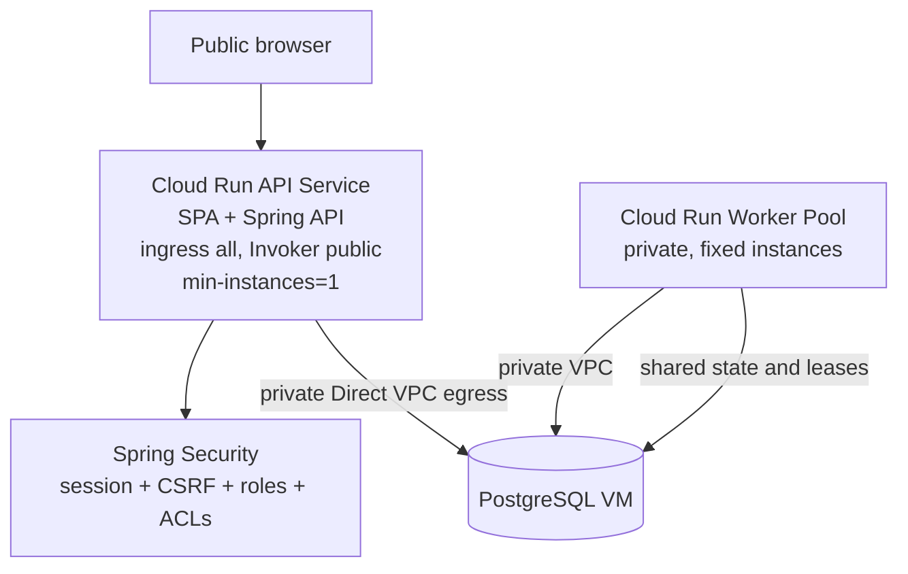

# Implementation Plan: Public Cloud Run Frontend

## Task Source — User request: publish the ReplicaDB frontend on Cloud Run so it can be accessed from the Internet, using the existing API and Worker Pool deployment.

### Acceptance Criteria

> ⚠️ Acceptance criteria inferred from the `/itx-explore` conversation because no JIRA ticket exists for this change.
>
> **Inferred Acceptance Criteria:**
> - The existing server image serves the React SPA at the Cloud Run service URL.
> - Browser routes such as `/login`, `/jobs`, `/datasources`, and `/runs/{id}` load the SPA when opened or refreshed directly.
> - The API and SPA use the same origin, preserving session cookies and CSRF behavior without a CORS configuration.
> - Public Cloud Run ingress is opt-in; the current private/authenticated deployment remains the default.
> - When public access is explicitly enabled, the Cloud Run service accepts browser traffic while Spring Security still requires authentication for protected API resources.
> - `/api/v1/auth/csrf` and `/api/v1/auth/login` remain reachable without an authenticated session, while protected resources return `401` before login.
> - The API runs with `min-instances=1` for the externally accessible control plane so Quartz remains active when no browser request is being made.
> - The Worker Pool and PostgreSQL VM remain private and are not granted public invoker access.
> - Tests prove SPA fallback, public-access opt-in, protected API behavior, and the final Cloud Run smoke path without exposing credentials or tokens.
> - Documentation explains the public-access trade-off, login flow, cost of `min-instances=1`, and cleanup commands.

## Overview

The released `osalvador/replicadb-server:1.0.0` image already contains `BOOT-INF/classes/static/index.html` and the Vite-built assets, so the frontend does not require a second hosting service for this trial. The API Cloud Run service can serve the SPA and proxy-relative `/api/v1` requests on the same origin. The missing pieces are browser-route fallback, an explicit public ingress/IAM option in the deployment bundle, and an external smoke check that proves the public shell is reachable without weakening application authorization.

The Worker Pool and the PostgreSQL VM remain private. The API service is public only at the Cloud Run edge when explicitly requested; data access continues to be governed by ReplicaDB session authentication, CSRF protection, roles, and job ACLs.

## Decisions

### D1: Frontend hosting → serve the existing SPA from the API Cloud Run Service

**Why**: The release JAR already contains the static frontend, and the frontend client uses relative `/api/v1` URLs with credentialed cookies. One origin avoids CORS, cross-site cookie, and CSRF complexity and requires no new frontend container.

**Assumptions / Constraints**: The API image must continue to package `static/index.html` and `static/assets/**`; future image changes must retain that packaging contract. The API service remains the only public-facing runtime component.

**Discarded**: A separate static-hosting service plus API proxy — it adds another service, identity hop, and cookie-routing problem without improving this trial's user workflow.

### D2: External access → explicit public Cloud Run ingress plus `allUsers` Invoker

**Why**: A browser outside the VPC cannot reach the current `internal-and-cloud-load-balancing` service. An explicit opt-in makes the trial usable while preserving the private default for existing deployments.

**Assumptions / Constraints**: Cloud Run IAM is only the network gate. Spring Security remains the application authorization boundary; protected `/api/v1` resources must still require a ReplicaDB session. Public access exposes login, CSRF bootstrap, health, static assets, and any currently public API documentation to the Internet.

**Discarded**: Removing Cloud Run IAM while keeping internal ingress — it does not make the service reachable from the public Internet. IAP is deferred because it introduces Google-identity onboarding and can overlap with ReplicaDB's own login model.

### D3: SPA navigation → server-side fallback for known frontend routes

**Why**: The React app uses `createBrowserRouter`, so direct requests to `/jobs` or `/datasources` must return `index.html`. The fallback must exclude `/api`, `/actuator`, `/v3/api-docs`, and static assets so backend errors and API authorization are not swallowed by the SPA.

**Assumptions / Constraints**: The fallback serves only the HTML shell; it does not authorize or expose application data. The frontend's protected-route logic continues to redirect unauthenticated users to `/login`.

**Discarded**: `HashRouter` — avoids server routing changes but produces less usable URLs and changes the existing frontend navigation contract.

### D4: API availability → `min-instances=1` for the public control plane

**Why**: Quartz scheduling and the managed control plane must keep running when there are no browser requests. A scale-to-zero API can make the UI appear healthy while scheduled work is paused.

**Assumptions / Constraints**: One continuously available instance has a cost; `min-instances=2` remains a future production availability choice. The Worker Pool count stays independently controlled.

**Discarded**: Keep `min-instances=0` for the public trial — cheaper, but it violates the scheduler's continuous-runtime requirement.

## Architecture & Design — Approach: pragmatic same-origin SPA/API publication with a private worker and database

The frontend's `apiClient` continues to use `baseURL: '/api/v1'` and `withCredentials: true`; no frontend API URL or CORS setting is introduced. The public Cloud Run setting is controlled by a deployment flag and recorded in deployment state. Private mode remains the default, and public mode must be visible in the redacted deployment summary.

The server fallback must distinguish UI routes from backend routes. A direct request to a UI route returns the packaged `index.html`; a direct request to `/api/v1/jobs` still reaches Spring Security and returns `401` without a session. Static resources remain served by Spring Boot's resource handler.

Security implications: `allUsers` Invoker makes the Cloud Run network endpoint public, but it does not bypass Spring Security. Protected `/api/v1` resources must still require a ReplicaDB session. Rate limiting, secure session cookies, CSRF, bootstrap-admin rotation, and application authorization remain required. The public smoke test must assert the unauthenticated boundary rather than treating an HTTP `200` from `/` as proof that data is public.

## Implementation Tasks

### 1. Add a server-side SPA fallback without changing API routing

- [x] **1.1 Implement an allowlisted SPA fallback controller**
  Files: new `replicadb-server/src/main/java/org/replicadb/server/web/SpaFallbackController.java`; `replicadb-server/src/main/java/org/replicadb/server/security/config/SecurityConfig.java`
  Changes: Add a GET-only, allowlisted fallback in a new `SpaFallbackController` with lowest MVC precedence, forwarding the frontend routes represented in `replicadb-server/frontend/src/router/routes.tsx` (including `/login`, `/profile`, `/jobs`, `/jobs/**`, `/datasources`, `/datasources/**`, `/runs/**`, `/audit`, and `/users`) to `/index.html`. Do not implement this as an unconditional `/**` fallback: exclude `/api/**`, `/actuator/**`, `/v3/api-docs/**`, `/assets/**`, `/favicon.ico`, and unknown backend paths before controller matching. Permit only the known HTML shell and frontend route patterns through Spring Security while leaving every `/api/v1/**` data endpoint protected except the existing CSRF/login bootstrap endpoints. Keep the fallback GET-only so API methods and problem responses are never intercepted.
  Tests: Extend `replicadb-server/src/test/java/org/replicadb/server/security/config/SecurityConfigTest.java` or add `replicadb-server/src/test/java/org/replicadb/server/web/SpaFallbackControllerTest.java` with MockMvc assertions that `/`, `/login`, `/jobs`, `/datasources/123`, and `/runs/123` return the SPA HTML; `/api/v1/jobs` remains `401` without a session; `/api/v1/does-not-exist` remains a `404` JSON/problem response and never HTML; `/assets/missing.js` and `/unknown-backend-path` are not converted into the SPA; and a known UI route remains reachable without authentication so the React login screen can render.
  Dependencies: None

### 2. Make public access explicit in the Cloud Run bundle

- [x] **2.1 Add opt-in public ingress and Invoker configuration**
  Files: `deploy/gcp/deploy.sh`; `deploy/gcp/config.example.env`; `deploy/gcp/lib/cloud_run_service.sh`; `deploy/gcp/lib/cleanup.sh`; `deploy/gcp/lib/state.sh`; `deploy/gcp/lib/verify.sh`; `deploy/gcp/tests/cloud_run_service_test.sh`; `deploy/gcp/tests/verify_test.sh`; `deploy/gcp/tests/cleanup_test.sh`; `deploy/gcp/README.md`
  Changes: Add `REPLICADB_PUBLIC_ACCESS=false` and a matching explicit CLI flag `--public-access`. Implement `cloud_run_set_public_access()` in `cloud_run_service.sh`, called after service creation/update and from cleanup: public mode sets `run.googleapis.com/ingress: all` and grants `roles/run.invoker` to `allUsers`; private mode retains `internal-and-cloud-load-balancing` and explicitly removes the `allUsers` binding with `gcloud run services remove-iam-policy-binding`. Store the public-access decision in redacted deployment state and display it in the summary. Do not grant any public Invoker role to the Worker Pool. Keep the current private default as a regression guard.
  Tests: Stub gcloud commands and assert private mode contains no public ingress or `allUsers` grant; public mode renders `ingress: all` and issues exactly one public Invoker binding; toggling back to private removes the binding; `destroy` removes the binding before deleting a public service; summaries and state contain the boolean decision but never credentials or tokens; verify rejects a public deployment when the service IAM update fails.
  Dependencies: Task 1.1

- [x] **2.2 Set the public control-plane instance floor to one**
  Files: `deploy/gcp/deploy.sh`; `deploy/gcp/config.example.env`; `deploy/gcp/README.md`; `deploy/gcp/tests/preflight_test.sh`; `deploy/gcp/tests/cloud_run_service_test.sh`
  Changes: Make `--api-min-instances` default to `1` for public frontend deployments and add a cross-field validation in `deploy.sh` that rejects `--public-access --api-min-instances 0` with an actionable Quartz/scheduler message before any gcloud mutation. Preserve an explicit `0` only for private, non-scheduled smoke scenarios if the existing contract needs it. Document the cost and the Quartz scheduling reason. Keep `--api-max-instances` bounded and ensure the rendered API service remains instance-based where continuous scheduler CPU is required.
  Tests: Assert public mode defaults to one; the exact `public access + min-instances=0` combination exits before any mutating command and reports the expected error; private mode preserves its documented behavior; and the rendered service contains the expected min/max scaling values.
  Dependencies: Task 2.1

### 3. Prove same-origin authentication and public boundaries

- [x] **3.1 Add frontend/API contract tests for login bootstrap and protected data**
  Files: `replicadb-server/src/test/java/org/replicadb/server/HealthEndpointTest.java`; `replicadb-server/src/test/java/org/replicadb/server/security/config/SecurityConfigTest.java`; `replicadb-server/frontend/src/api/client.test.ts`; `replicadb-server/frontend/src/pages/LoginPage.test.tsx`; new `replicadb-server/frontend/e2e/public-cloud-run-smoke.spec.ts`
  Changes: Add tests for public `/index.html` and SPA routes, `GET /api/v1/auth/csrf` cookie initialization, login request cookie/CSRF behavior, and `401` responses for protected resources without a session. Keep the API client configured with relative `/api/v1`, `withCredentials`, `XSRF-TOKEN`, and `X-XSRF-TOKEN`; do not introduce a cross-origin API base URL. Make the Playwright smoke accept `REPLICADB_PUBLIC_SMOKE_URL`, `REPLICADB_PUBLIC_SMOKE_USERNAME`, and `REPLICADB_PUBLIC_SMOKE_PASSWORD_FILE`; read the password only from the file at runtime, never from a command argument or committed environment file, and never print it.
  Tests: Unit tests for client credentials/XSRF configuration; MockMvc tests for public shell, CSRF, login, protected API, and unauthenticated problem details; Playwright coverage for loading `/`, refreshing `/jobs`, seeing the login screen, and verifying that a protected dashboard request is not served anonymously. Mark real credential execution as opt-in and never run it with repository-stored passwords.
  Dependencies: Task 1.1

- [x] **3.2 Add a GCP public-frontend smoke command**
  Files: new `scripts/phase5-gcp-frontend-smoke.sh`; `scripts/README.md`; `deploy/gcp/README.md`
  Changes: Add a bounded, read-only smoke that accepts project, region, service, and URL inputs; uses `curl -sS -o body -D headers -w '%{http_code}'` to assert `GET /` and `GET /login` return `200` HTML containing the SPA title, `GET /api/v1/auth/csrf` returns `200` and a `Set-Cookie` header containing `XSRF-TOKEN`, and `GET /api/v1/jobs` without a session returns exactly `401` with a `Content-Type` containing `application/problem+json` (the response body is not printed). Add optional Playwright/login execution behind the explicit `REPLICADB_PUBLIC_SMOKE_*` inputs. Redact authorization headers, cookies, passwords, and response bodies that could contain credentials. Do not mutate IAM or deploy resources from the smoke script. Include a cleanup-free mode because it only verifies an already deployed service.
  Tests: Shell tests with stubbed curl/gcloud for healthy SPA, 404 shell, unexpected public data response, CSRF failure, timeout, wrong status, wrong content type, and cookie/header redaction; one manual run against the disposable GCP service after public access is enabled.
  Dependencies: Task 2.1, Task 3.1

### 4. Document and validate the operator workflow

- [x] **4.1 Document public frontend access and private runtime boundaries**
  Files: `deploy/gcp/README.md`; `docs/src/content/docs/operations/gcp-cloud-run.mdx`; `DEPLOYMENT.md`; `docs/src/content/docs/operations/index.md`; `docs/astro.config.mjs`; `docs/tests/operations-contract.test.mjs`
  Changes: Use `deploy/gcp/README.md` as the copyable command/reference guide: flags, service URL, IAM inspection, smoke commands, and cleanup. Use `docs/src/content/docs/operations/gcp-cloud-run.mdx` for architecture, security, same-origin CSRF, direct-route fallback, `min-instances=1`, instance-based billing, and the private Worker Pool/VM boundary. Use `DEPLOYMENT.md` only for a short cross-link from the general topology guide, and register the canonical operations page through `docs/src/content/docs/operations/index.md` and `docs/astro.config.mjs`; do not duplicate the full runbook across all five files. Include a warning that enabling `allUsers` is unsuitable without application hardening, rate monitoring, and credential rotation.
  Tests: Extend operations content-contract assertions for `REPLICADB_PUBLIC_ACCESS`, `min-instances`, SPA fallback, `roles/run.invoker`, CSRF, private Worker Pool, and cleanup; assert the command guide and conceptual operations page each contain their assigned content; run slug checks, docs tests, and Astro check/build.
  Dependencies: Task 2.1, Task 2.2, Task 3.2

- [ ] **4.2 Run the complete implementation validation against the disposable deployment**
  Files: `scripts/phase5-gcp-frontend-smoke.sh`; `deploy/gcp/tests/test_runner.sh`; `replicadb-server/src/test/java/org/replicadb/server/security/config/SecurityConfigTest.java`; `replicadb-server/frontend/e2e/public-cloud-run-smoke.spec.ts`; `implementation_plan.md`
  Changes: Execute shell unit tests, Java focused tests, frontend typecheck/unit tests, docs contracts, the public frontend smoke, and a browser refresh test against the deployed Cloud Run URL. Verify API `Ready=True`, Worker Pool `Ready=True`, PostgreSQL connectivity, protected API `401` behavior, login success, and direct navigation to `/jobs`. Record residual warnings separately from deployment failures. Keep credentials out of logs and remove public Invoker access or destroy the disposable deployment after verification.
  Tests: The full acceptance run must include private-mode regression, public-mode deployment, `/` and `/login` HTTP checks, CSRF bootstrap, unauthenticated protected API check, authenticated browser flow, API readiness, worker readiness, and cleanup verification.
  Dependencies: Task 1.1, Task 2.1, Task 2.2, Task 3.1, Task 3.2, Task 4.1

## Technical Reference

Types & Data Structures

No new domain types are required. The server adds a web-layer fallback controller only. The deployment state gains a boolean public-access field alongside the existing service name, region, mode, image digest, secret references, and ownership fields. Secret payloads, session cookies, CSRF values, and identity tokens remain excluded from state and logs.

Dependencies

Runtime dependencies remain Spring Boot, React/Vite, Bash, `gcloud`, `curl`, and Playwright for the opt-in browser smoke. No new runtime Java or frontend dependency is expected. Cloud Run IAM, Cloud Run ingress, Secret Manager, and the existing VPC/Worker Pool resources are the relevant platform surfaces. The API service account, Worker Pool service account, and PostgreSQL VM remain separate concerns.

Testing Strategy

Use MockMvc for server routing and authorization boundaries, Vitest for frontend client behavior, Playwright for direct-route/login browser behavior, deterministic shell stubs for public-access command rendering, and one explicit GCP smoke against the disposable deployment. Private mode remains a regression case. The smoke must prove that public Cloud Run reachability does not make protected ReplicaDB data anonymous. Cleanup or public Invoker removal is part of the final acceptance run.

## Plan Status

This is the active plan for the frontend publication work. The previously completed Cloud Run API/Worker Pool deployment work is treated as an existing dependency; `/itx-code` should execute only the unchecked tasks in this active section.
